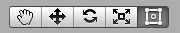

# Basic Layout 基本布局

In this section we’ll look at how you can position UI elements relative to the Canvas and each other. If you want to test yourself while reading, you can create an Image using the menu GameObject -> UI -> Image.

在这一部分我们将看看如何相对Canvas和其他来定位UI元素。如果你想在阅读时进行试验，你可以通过菜单“GameObject -> UI -> Image”来创建一个image。

##The Rect Tool 矩形工具

Every UI element is represented as a rectangle for layout purposes. This rectangle can be manipulated in the Scene View using the Rect Tool in the toolbar. The Rect Tool is used both for Unity’s 2D features and for UI, and in fact can be used even for 3D objects as well.

为了布局目的，每一个UI元素都被展示为一个矩形。这个矩形在场景视图（Scene View）中可以被工具栏中的矩形工具（Rect Tool）来操纵。

为了布局的目的，每一个UI元素都被展示为一个矩形。这个矩形可以在场景视图（Scene View）中使用工具条中的矩形工具（Rect Tool）来操纵。矩形工具既可以在Unity 2D功能中使用，也可以在UI中使用，事实上甚至也可以运用于3D对象。

######Toolbar buttons with Rect Tool selected

Toolbar buttons with Rect Tool selected
The Rect Tool can be used to move, resize and rotate UI elements. Once you have selected a UI element, you can move it by clicking anywhere inside the rectangle and dragging. You can resize it by clicking on the edges or corners and dragging. The element can be rotated by hovering the cursor slightly away from the corners until the mouse cursor looks like a rotation symbol. You can then click and drag in either direction to rotate.

Rect Tool 可以被用作移动，改变大小和旋转UI对象。一旦你选择了一个UI对象，你可以通过点击矩形中的任一点并拖动来移动它。你可以通过点击边或角并拖动来改变它的大小。将鼠标指针悬停在略微远离角落直到鼠标指针看起来像旋转的标志，你可以点击并向任何一个方向拖动来旋转UI对象。

Just like the other tools, the Rect Tool uses the current pivot mode and space, set in the toolbar. When working with UI it’s usually a good idea to keep those set to Pivot and Local.

就像其他工具一样，Rect Tool 使用在工具条中设置的当前枢轴模式（pivot mode）和空间。当你做有关UI的工作时，保持那些设置为Pivot和Local通常是一个好主意。

Toolbar buttons set to Pivot and Local
Toolbar buttons set to Pivot and Local
Rect Transform

The Rect Transform is a new transform component that is used for all UI elements instead of the regular Transform component.

Rect Transform是一种新的transform组件用于所有UI元素，来代替通常的Transform的组件。

Rect Transforms have position, rotation, and scale just like regular Transforms, but it also has a width and height, used to specify the dimensions of the rectangle.

Rect Transform 有如同通常的Transform一样的位置，旋转，和尺寸。但是它还具有宽度和高度，用来指定矩形的尺寸。

Resizing Versus Scaling

When the Rect Tool is used to change the size of an object, normally for Sprites in the 2D system and for 3D objects it will change the local scale of the object. However, when it’s used on an object with a Rect Transform on it, it will instead change the width and the height, keeping the local scale unchanged. This resizing will not affect font sizes, border on sliced images, and so on.

当Rect Tool被用来改变一个对象的大小，通常是改变2D系统的精灵和3D对象时，它会改变对象的本体大小。但是，当它被用于一个包含Rect Transform组件的对象上时，它会转而改变宽度和高度，保持自身缩放不变。这个大小调整的动作将不会影响字体大小，切片图形的边框等等。

Pivot

Rotations, size, and scale modifications occur around the pivot so the position of the pivot affects the outcome of a rotation, resizing, or scaling. When the toolbar Pivot button is set to Pivot mode, the pivot of a Rect Transform can be moved in the Scene View.

旋转，大小和缩放修改在Pivot周围发生，所以Pivot的位置影响到旋转、跳转大小或者缩放的效果。当工具条的Pivot按钮被设定为Pivot模式，Rect Transform的pivot可以在Scene视图中移动。

Anchors

Rect Transforms include a layout concept called anchors. Anchors are shown as four small triangular handles in the Scene View and anchor information is also shown in the Inspector.

Rect Transform 包括一种布局概念被称作anchors（锚点）。Anchors在Scene视图中被展现为4个小三角形的柄，并且anchor的信息也被展现在Inspector视图中。

If the parent of a Rect Transform is also a Rect Transform, the child Rect Transform can be anchored to the parent Rect Transform in various ways. For example, the child can be anchored to the center of the parent, or to one of the corners.

如果Rect Transform的父对象也是一个Rect Transform，那么子Rect Transform可以被可视化地锚定到父Rect Transform上。举个例子，子对象可以被锚定到父对象的中心，或者一个角落。

UI element anchored to the center of the parent. The element maintains a fixed offset to the center.
UI element anchored to the center of the parent. The element maintains a fixed offset to the center.

UI元素被锚定到父对象的中心，这个元素相对中心保持了一个固定的偏移

UI element anchored to the lower right corner of the parent. The element maintains a fixed offset to the lower right corner.
UI element anchored to the lower right corner of the parent. The element maintains a fixed offset to the lower right corner.

UI元素被锚定到父对象的右下角，元素相对与右下角保持了一个固定的偏移

The anchoring also allows the child to stretch together with the width or height of the parent. Each corner of the rectangle has a fixed offset to its corresponding anchor, i.e. the top left corner of the rectangle has a fixed offset to the top left anchor, etc. This way the different corners of the rectangle can be anchored to different points in the parent rectangle.

锚定也允许子对象与父对象的宽高一起延展。矩形的每个角有一个相对其相应的锚的固定偏移。即，矩形的左上对锚的左上保持一个固定的偏移，诸如此类。这样矩形的不同角就能锚定到父矩形的不同点上。

UI element with left corners anchored to lower left corner of the parent and right corners anchored to lower right. The corners of the element maintains fixed offsets to their respective anchors.
UI element with left corners anchored to lower left corner of the parent and right corners anchored to lower right. The corners of the element maintains fixed offsets to their respective anchors.

左边两角锚定到父对象左下角且右边两角锚定到父对象右下角的UI元素。元素的四角和它们各自的锚点保持一个固定的偏移。

The positions of the anchors are defined in fractions (or percentages) of the parent rectangle width and height. 0.0 (0%) corresponds to the left or bottom side, 0.5 (50%) to the middle, and 1.0 (100%) to the right or top side. But anchors are not limited to the sides and middle; they can be anchored to any point within the parect rectangle.

anchors的位置被定义为父对象矩形的宽和高的分数（或者百分比）。0.0（0%）相当于左边或者底边，0.5（50%）相当于中心，而1.0（100%）相当于右边或者顶边。但是锚点不限于边或者中心；它们可以被锚定到父矩阵内部的任意一点。

UI element with left corners anchored to a point a certain percentage from the left side of the parent and right corners anchored to a point a certain percentage from the right side of the parent rectangle.
UI element with left corners anchored to a point a certain percentage from the left side of the parent and right corners anchored to a point a certain percentage from the right side of the parent rectangle.

UI元素，它的左边两角锚定到距父对象左边特定百分比的一点，且它的右边两点锚定到距父对象右边特定百分比的一点。

You can drag each of the anchors individually, or if they are together, you can drag them together by clicking in the middle in between them and dragging. If you hold down Shift key while dragging an anchor, the corresponding corner of the rectangle will move together with the anchor.

你可以单独拖动任意一个锚点，或者如果它们在一起，你可以一起拖动他们，通过点击它们的中心然后拖动。如果你在拖动锚点的同时按住Shift键，矩形相应的角将会和锚点一起移动。

A useful feature of the anchor handles is that they automatically snap to the anchors of sibling rectangles to allow for precise positioning.

锚点柄的一个有用的特点是它们自动地对齐到兄弟矩形的锚点来顾及精确的定位。

Anchor presets

In the Inspector, the Anchor Preset button can be found in the upper left corner of the Rect Transform component. Clicking the button brings up the Anchor Presets dropdown. From here you can quickly select from some of the most common anchoring options. You can anchor the UI element to the sides or middle of the parent, or stretch together with the parent size. The horizontal and vertical anchoring is independent.

在Inspector视图中，锚点预设按钮可以在Rect Transform组件的左上角被找到。点击这个按钮你可以调出锚点预设下拉菜单。在这里你可以快速地从一些通常锚点选项中选择。你可以设置UI元素的锚点到父对象的边缘或者中心，或者随父对象的大小一起延展。横竖锚定是独立的。

The Anchor Presets buttons displays the currently selected preset option if there is one. If the anchors on either the horizontal or vertical axis are set to different positions than any of the presets, the custom options is shown.

如果有选择预设的话，锚点预设按钮展示当前选择的预设选项。如果横纵轴的任意锚点被设置为与预设不同，那就会显示定制这个选项的图标。

Anchor and position fields in the Inspector

You can click the Anchors expansion arrow to reveal the anchor number fields if they are not already visible. Anchor Min corresponds to the lower left anchor handle in the Scene View, and Anchor Max corresponds to the upper right handle.

你可以单击锚点扩展箭头来显示锚点的数字域如果它们并不可见的话。Anchor Min对应Scene视图中的左下锚点柄，Anchor Max对应右上锚点柄。

The position fields of rectangle are shown differently depending on whether the anchors are together (which produces a fixed width and height) or separated (which causes the rectangle to stretch together with the parent rectangle).

矩形位置域的展示取决于锚点是否在一起，当锚点在一起时会导致固定的宽高，当锚点分离时就会导致矩形会和父矩形一起延展。

When all the anchor handles are together the fields displayed are Pos X, Pos Y, Width and Height. The Pos X and Pos Y values indicate the position of the pivot relative to the anchors.

当所有锚点柄在一起时数字域显示Pos X（X位置坐标）, Pos Y（Y位置坐标）, Width（宽）和Height（高）。Pos X和Pos Y的值指明了pivot（枢轴）相对与anchors（锚点）的位置。

When the anchors are separated the fields can change partially or completely to Left, Right, Top and Bottom. These fields define the padding inside the rectangle defined by the anchors. The Left and Right fields are used if the anchors are separated horizontally and the Top and Bottom fields are used if they are separated vertically.

当锚点分离，数字域将部分或者全部变为Left（左），Right（右），Top（顶），Bottom（底）。这些域定义了锚点所定义的矩形中的边距。如果横向的锚点分离，Left和Right域会被使用。如果纵向的锚点分离，Top和Button域会被使用。

Note that changing the values in the anchor or pivot fields will normally counter-adjust the positioning values in order to make the rectangle stay in place. If cases where this is not desired, the Raw Mode can be enabled using a small button in the Inspector. This causes the anchor and pivot value to be able to be changed without any other values changing as a result. This will likely cause the rectangle to be visually moved or resized, since its position and size is dependent on the anchor and pivot values.

注意，改变anchor或pivot域中的值通常会逆向调整位置值来使得矩形归位。如果在不尽人意的情况下，可以通过点击Inspector界面的一个小按钮来使用Raw模式。这会导致锚点和枢轴能够被改变而不会因此改变任何其他值。这将大概导致矩形可视化的移动或改变大小，及时它的位置和大小取决于锚点和枢轴值。
