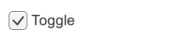
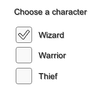

# Interaction Components

This section covers components in the UI system that handles interaction, such as mouse or touch events and interaction using a keyboard or controller.

本节涵盖了处理交互，例如鼠标或触摸事件和使用键盘或控制器交互的 UI 系统中的组件

The interaction components are not visible on their own, and must be combined with one or more visual elements in order to work correctly.

##Common Functionality

Most of the interaction components have some things in common. They are selectables, which means they have shared built-in functionality for visualising transitions between states (normal, highlighted, pressed, disabled), and for navigation to other selectables using keyboard or controller. This shared functionality is described on the Selectable page.

所有交互组件都有一些共同点。selectables 是他们所有的控件的基类，这意味着他们都 有共享状态，之间的前瞻转换和导航到其他使用键盘或控制器的 selectables 的内置功能。 此处介绍的这种共享的功能。 在一个 selectable 组件内有几个 transition 选项可选择目前是在哪一状态。不同的状态 有： normal 正常、 highlighted 突出显示、 pressed 按下和 disabled 禁用。 这里是 transition 过渡选项： · Color Tint -，是根据按钮处于什么状态改变颜色，每个状态可以对应一种颜色。它也是 可能在不同的状态之间设置的 Fade Duration。数值越高，淡入淡出颜色之间将会越慢。 · SpriteSwap -根据按钮处于什么状态改变图片，精灵可以定制显示。 · 动画-根据按钮处于什么状态执行不同的动画，animator 组件必须存在才能使用的动画 过渡。它是重要的是确保根运动处于禁用状态。若要创建 animation controller 单击生成 动画 （或您自己创建），并确保动画控制器已被添加到按钮的动画组件。有关详细信息， 请参见 Animation Integration。 · None-此选项是按钮根本就没有状态的影响。  
Navigation 导航选项是指在播放模式中的 uGUI 元素的将如何导航控制。 

##Button

A Button has an **OnClick** UnityEvent to define what it will do when clicked.

See the Button page for details on using the Button component.

##Toggle

A Toggle has an Is On checkbox that determines whether the Toggle is currently on or off. This value is flipped when the user clicks the Toggle, and a visual checkmark can be turned on or off accordingly. It also has an OnValueCHanged UnityEvent to define what it will do when the value is changed.

See the Toggle page for details on using the Toggle component.

##Toggle Group

A Toggle Group can be used to group a set of Toggles that are mutually exclusive. Toggles that belong to the same group are constrained so that only one of them can be selected at a time - selecting one of them automatically deselects all the others.

See the Toggle Group page for details on using the Toggle Group component.

##Slider

A Slider has a decimal number Value that the user can drag between a minimum and maximum value. It can be either horizontal or vertical. It also has a OnValueChanged UnityEvent to define what it will do when the value is changed.

See the Slider page for details on using the Slider component.

##Scrollbar

A Scrollbar has a decimal number Value between 0 and 1. When the user drags the scrollbar, the value changes accordingly.

Scrollbars are often used together with a Scroll Rect and a Mask to create a scroll view. The Scrollbar has a Size value between 0 and 1 that determines how big the handle is as a fraction of the entire scrollbar length. This is often controlled from another component to indicate how buig a proportion of the content in a scroll view is visible. The Scroll Rect component can automatically do this.

The Scrollbar can be either horizontal or vertical. It also has a OnValueChanged UnityEvent to define what it will do when the value is changed.

See the Scrollbar page for details on using the Scrollbar component.

##Dropdown

A Dropdown has a list of options to choose from. A text string and optionally an image can be specified for each option, and can be set either in the Inspector or dynamically from code. It has a OnValueChanged UnityEvent to define what it will do when the currently chosen option is changed.

See the Dropdown page for details on using the Dropdown component.

##Input Field

An Input Field is used to make the text of a Text Element editable by the user. It has a UnityEvent to define what it will do when the text content is changed, and an another to define what it will do when the user has finished editing it.

See the Input Field page for details on using the Input Field component.

##Scroll Rect (Scroll View)

A Scroll Rect can be used when content that takes up a lot of space needs to be displayed in a small area. The Scroll Rect provides functionality to scroll over this content.

Usually a Scroll Rect is combined with a Mask in order to create a scroll view, where only the scrollable content inside the Scroll Rect is visible. It can also additionally be combined with one or two Scrollbars that can be dragged to scroll horizontally or vertically.

See the Scroll Rect page for details on using the Scroll Rect component.