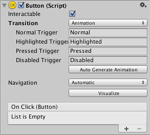
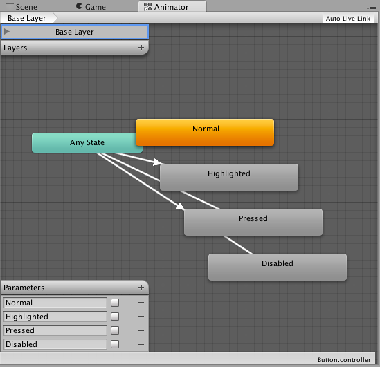
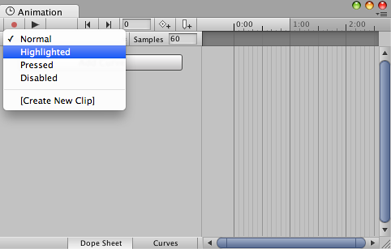

# Animation Integration

Animation allows for each transition between control states to be fully animated using Unity’s animation system. This is the most powerful of the transition modes due the the number of properties that can be animated simultaneously.

动画允许控件的所有状态之间相互转换，充分使用 unity 的动画系统。这是最强大的的 转换模式的在处理很多属性的同时可以进行动画

To use the Animation transition mode, an Animator Component needs to be attached to the controller element. This can be done automatically by clicking “Auto Generate Animation”. This also generates an Animator Controller with states already set up, which will need to be saved.

要使用动画转换模式，动画组件需要连接到该控制器的元素。这可以通过单击“Auto Generate Animation”.自动完成。这个动画控制器的所有状态已经被设置完成了，会弹出对话 框需要保存动画控制器。  那么组件就被添加了。  同时还有保存的动画控制器。 

The new Animator controller is ready to use straight away. Unlike most Animator Controllers, this controller also stores the animations for the controller’s transitions and these can be customised, if desired.

新的动画控制器是准备马上使用。不同于大多数动画控制器，该控制器还存储控制器的 转换动画并且如果需要的话这些可以定制。 

For example, if a Button element with an Animator controller attached is selected, the animations for each of the button’s states can be edited by opening the Animation window (Window>Animation).

例如，如果选择了带有附加动画控制器按钮对象，我们可以通过打开动画编辑器，为按 钮的每个状态的编辑动画，(Window>Animation).。 

There is an Animation Clip pop-up menu to select the desired clip. Choose from “Normal”, “Highlighted”, “Pressed” and “Disabled”.

还有动画剪辑 Clip 的弹出式菜单。从"正常"Normal，"突出显示"Highlighted，选择"按 下"Pressed 和"禁用"Disabled 中选择所需的剪辑

The Normal State is set by the values on button element itself and can be left empty. On all other states, the most common configuration is a single keyframe at the start of the timeline. The transition animation between states will be handled by the Animator.

Normal 状态是就是按钮元素本身的值，可以留空。在所有其他状态，最常见的配置是 单个关键帧在时间线的开始。动画状态之间的转换将由 Animator 处理。 

As an example, the width of the button in the Highlighted State could be changed by selecting the Highlighted state from the Animation Clip pop up menu and with the playhead at the start of the time line:

作为一个例子，可以通过从动画剪辑 Clip 弹出式菜单中选择高亮显示状态并与 playhead 设置置在时间线的开始处改变按钮高亮状态的宽度： 

* Select the record Button
* Change the width of the Button in the inspector
* Exit the record mode.

* Select record 记录按钮 
* Change 在 inspector 中按钮的宽度 inspector 
* Exit 记录模式。

Change to play mode to see how the button grows when highlighted.

单击 Play 按钮，当按钮处于高亮时观察大小的变化。 

Any number of properties can have their parameters set in this one keyframe.

任意数量的属性可以有在这一关键帧中设置其参数
Several buttons can share the same behaviour by sharing Animator Controllers.

The UI Animation transition mode is not compatible with Unity’s legacy animation system. You should only use the Animator Component.