# Rich Text

<!--BeginSwitchLink--><!--EndSwitchLink-->
<div class="clear"></div>

The text for UI elements and text meshes can incorporate multiple font styles and sizes. Rich text is supported both for the UI System and the legacy GUI system. The Text, GUIStyle, GUIText and TextMesh classes have a <span class="doc-keyword">Rich Text</span> setting which instructs Unity to look for markup tags within the text. The [Debug.Log](../ScriptReference/Debug.Log.html) function can also use these markup tags to enhance error reports from code. The tags are not displayed but indicate style changes to be applied to the text.

UI 元素和文本网格的文本可以合并多个字体样式和大小。对 UI 系统和传统的 GUI 系 统都支持富文本。Text、 GUIStyle、 GUIText 和 TextMesh 的类有丰富文本设置指导 unity 寻 找 tags 标记的文本。Debug.Log 函数也可以使用这些标记来提高代码的错误报告。tags 不会 显示，但显示样式的更改会应用于文本

## Markup format

The markup system is inspired by HTML but isn’t intended to be strictly compatible with standard HTML. The basic idea is that a section of text can be enclosed inside a pair of matching tags:-

标记 markup 系统由 HTML 启发，但也不打算成为严格地符合标准的 HTML。其基本思 想是可以里面一对匹配的标记 tags 括起来的一段文本：- 

   We are <b>not</b> amused

As the example shows, the tags are just pieces of text inside the “angle bracket” characters, < and >. The text inside the tag denotes its name (which in this case is just **b**). Note that the tag at the end of the section has the same name as the one at the start but with the slash / character added. The tags are not displayed to the user directly but are interpreted as instructions for styling the text they enclose. The b tag used in the example above applies boldface to the word “not”, so the text will appear onscreen as:-

如示例所示，标签 tags 只是一张的"尖括号"字符， < 和 >。在 text 内的标签表示其名 称 （即在这种情况下只是 b）。注意 结束标记具有和开始相同的名称，但 添加斜杠 / 字符。 标签不直接显示给用户，但将被解释为关于 styling 的文本说明。在上面的示例中使用的 b 标记的黑体字单词"not"，因此文本将出现在屏幕上为：- 

   We are **not** amused

A marked up section of text (including the tags that enclose it) is referred to as an **element**.

### Nested elements

It is possible to apply more than one style to a section of text by “nesting” one element inside another

   We are <b><i>definitely not</i></b> amused

The i tag applies italic style, so this would be presented onscreen as

   We are **_definitely not_** amused

Note the ordering of the ending tags, which is in reverse to that of the starting tags. The reason for this is perhaps clearer when you consider that the inner tags need not span the whole text of the outermost element

   We are <b>absolutely <i>definitely</i> not</b> amused

which gives

   We are **absolutely _definitely_ not** amused

### Tag parameters

Some tags have a simple all-or-nothing effect on the text but others might allow for variations. For example, the **color** tag needs to know which color to apply. Information like this is added to tags by the use of **parameters**:-

   We are <color=green>green</color> with envy

Note that the ending tag doesn’t include the parameter value. Optionally, the value can be surrounded by quotation marks but this isn’t required.

## Supported tags

The following list describes all the styling tags supported by Unity.

| **Tag** | **Description** | **Example** | **Notes** |
| -- | -- | -- | -- |
|**b**|Renders the text in boldface.|   We are <b>not</b> amused.|
|**i**|Renders the text in italics.|   We are <i>usually</i> not amused.|
|**size**|Sets the size of the text according to the parameter value, given in pixels.|   We are <size=50>largely</size> unaffected.|Although this tag is available for Debug.Log, you will find that the line spacing in the window bar and Console looks strange if the size is set too large.|
|**color**|Sets the color of the text according to the parameter value. The color can be specified in the traditional HTML format. _   #rrggbbaa_ …where the letters correspond to pairs of hexadecimal digits denoting the red, green, blue and alpha (transparency) values for the color. For example, cyan at full opacity would be specified by|_   <color=#00ffffff>…_|Another option is to use the name of the color. This is easier to understand but naturally, the range of colors is limited and full opacity is always assumed. _   <color=cyan>…_ The available color names are given in the table below.|

|**Color name**|**Hex value**|**Swatch**|
| -- | -- | -- | -- |
|aqua (same as cyan)|`#00ffffff`|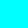|
|black|`#000000ff`||
|blue|`#0000ffff`|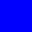|
|brown|`#a52a2aff`||
|cyan (same as aqua)|`#00ffffff`||
|darkblue|`#0000a0ff`|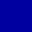|
|fuchsia (same as magenta)|`#ff00ffff`|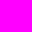|
|green|`#008000ff`|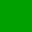|
|grey|`#808080ff`||
|lightblue|`#add8e6ff`||
|lime|`#00ff00ff`|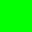|
|magenta (same as fuchsia)|`#ff00ffff`||
|maroon|`#800000ff`||
|navy|`#000080ff`|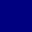|
|olive|`#808000ff`|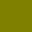|
|orange|`#ffa500ff`||
|purple|`#800080ff`|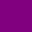|
|red|`#ff0000ff`|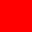|
|silver|`#c0c0c0ff`||
|teal|`#008080ff`||
|white|`#ffffffff`||
|yellow|`#ffff00ff`|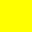|


**material**

This is only useful for text meshes and renders a section of text with a material specified by the parameter. The value is an index into the text mesh’s array of materials as shown by the inspector.

We are <material=2>texturally</material> amused

**quad**

This is only useful for text meshes and renders an image inline with the text. It takes parameters that specify the material to use for the image, the image height in pixels, and a further four that denote a rectangular area of the image to display. Unlike the other tags, quad does not surround a piece of text and so there is no ending tag - the slash character is placed at the end of the initial tag to indicate that it is “self-closing”.

```
<quad material=1 size=20 x=0.1 y=0.1 width=0.5 height=0.5 />
```

This selects the material at position in the renderer’s material array and sets the height of the image to 20 pixels. The rectangular area of image starts at given by the x, y, width and height values, which are all given as a fraction of the unscaled width and height of the texture.

##Editor GUI

Rich text is disabled by default in the editor GUI system but it can be enabled explicitly using a custom GUIStyle. The richText property should be set to true and the style passed to the GUI function in question:-

```
GUIStyle style = new GUIStyle ();
style.richText = true;
GUILayout.Label("<size=30>Some <color=yellow>RICH</color> text</size>",style);
```