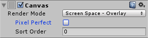
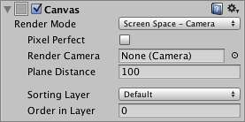
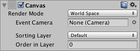
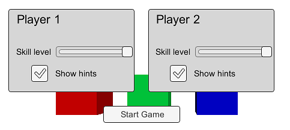
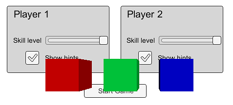
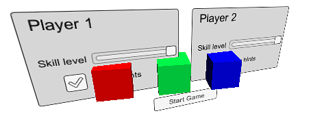

# Canvas

The Canvas component represents the abstract space in which the UI is laid out and rendered. All UI elements must be children of a GameObject that has a Canvas component attached. When you create a UI element object from the menu (GameObject > Create UI), a Canvas object will be created automatically if there isn’t one in the scene already.

######Screen Space - Overlay Set

######Screen Space - Camera Set

######World Space Set

##Properties

|** Property:	** | **Function:** |
| -- | -- |
| Render Mode	 | The way the UI is rendered to the screen or as an object in 3D space (see below). The options are Screen Space - Overlay, Screen Space - Camera and World Space. |
| Pixel Perfect (Screen Space modes only)	 | Should the UI be rendered without antialiasing for precision? |
| Render Camera (Screen Space - Camera mode only)	 | The camera to which the UI should be rendered (see below). |
| Plane Distance (Screen Space - Camera mode only)	 | The distance at which the UI plane should be placed in front of the camera. |
| Event Camera (World Space mode only)	 | The camera that will be used to process UI events. |
| Receives Events	 | Are UI events processed by this Canvas? |

##Details

A single Canvas for all UI elements is sufficient but multiple Canvases in the scene is possible. It is also possible use nested Canvases, where one Canvas is placed as a child of another for optimization purposes. A nested Canvas uses the same Render Mode as its parent.

一个画布上为所有的 UI 元素是足够，但在场景中有多张画布也是可能的。这也是可能 使用嵌套的画布，一张画布的位置作为一个孩子的另一个用于优化的目的。一个嵌套的画布 使用的呈现模式和其父相同

Traditionally, UIs are rendered as if they were simple graphic designs drawn directly on the screen. That is to say, they have no concept of a 3D space being viewed by a camera. Unity supports this kind of screen space rendering but also allows UIs to rendered as objects in the scene, depending on the value of the Render Mode property. The modes available are Screen Space - Overlay, Screen Space - Camera and World Space.

传统上，Ui 呈现好像他们是直接在屏幕上绘制简单的图形设计。即是说，他们有没有 被一个摄像头查看一个 3D 空间的概念。unity 支持屏幕空间这种渲染，但是也允许在场景 作为对象，根据的 Render Mode 属性值呈现 Ui。可用的模式有 Screen Space - Overlay, Screen Space - Camera and World Space.

###Screen Space - Overlay

In this mode, the Canvas is scaled to fit the screen and then rendered directly without reference to the scene or a camera (the UI will be rendered even if there is no camera in the scene at all). If the screen’s size or resolution are changed then the UI will automatically rescale to fit. The UI will be drawn over any other graphics such as the camera view.

######Overlay UI rendered over scene objects
###Screen Space - Camera

In this mode, the Canvas is rendered as if it were drawn on a plane object some distance in front of a given camera. The onscreen size of the UI does not vary with the distance since it is always rescaled to fit exactly within the camera frustum. If the screen’s size or resolution or the camera frustum are changed then the UI will automatically rescale to fit. Any 3D objects in the scene that are closer to the camera than the UI plane will be rendered in front of the UI, while objects behind the plane will be obscured.

######Camera mode UI with scene objects in front
###World Space

This mode renders the UI as if it were a plane object in the scene. Unlike Screen Space - Camera mode, however, the plane need not face the camera and can be oriented however you like. The size of the Canvas can be set using its Rect Transform but its onscreen size will depend on the viewing angle and distance of the camera. Other scene objects can pass behind, through or in front of the Canvas.

######World space UI intersecting scene objects
Hints

* Read more about setting up a World Space Canvas on the Creating a World Space UI page.
* For information about making your Canvas and UI scale to different resolutions or aspect ratios, see the Designing UI for Multiple Resolutions page as well as the Canvas Scaler page.