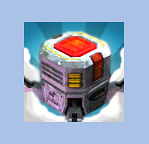
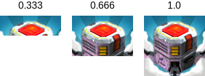
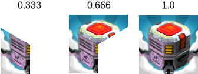

# Image

The Image control displays a non-interactive image to the user. This can be used for decoration, icons, etc, and the image can also be changed from a script to reflect changes in other controls. The control is similar to the Raw Image control but offers more options for animating the image and accurately filing the control rectangle. However, the Image control requires its texture to be a Sprite, while the Raw Image can accept any texture.

图像控件向用户显示一个非交互式的图像。这可以用于装饰、 图标等，和图像也可以 从一个脚本来反映在其他控件中的更改。该控件是类似于 Raw Image control 但提供更多的 选择动画图像和准确归档控件的矩形。然而，图像控件需要纹理是精灵，而 Raw Image 可以 接受任何纹理。  

######An Image control
##Properties

| Property:	 | Function: |
| -- | -- |
| Source Image	 | The texture that represents the image to display (which must be imported as a Sprite). |
| Color	 | The color to apply to the image. |
| Material	 | The Material to use for rendering the image. |
| Image Type	 | The method used to display the image. The options are Simple, Sliced, Tiled and Filled (see below). |
| Preserve Aspect (Simple and Filled Image Types only)	 | Should the image’s original proportions of height and width be kept rather than rescaled? |
| Fill Center (Sliced and Tiled Image Types only)	 | Should the center slice of the image be filled as well as the borders? |
| Fill Method (Filled Image Type only)	 | Specifies the way the image should “grow” to fill the space during an animation. The options are Horizontal, Vertical, Radial90, Radial180 and Radial360 (see below). |
| Fill Origin (Filled Image Type only)	 | The point in the image from which the fill should proceed. The options are various combinations of Bottom, Top, Left and Right, depending on which Fill Method is selected (see below). |
| Fill Amount (Filled Image Type only)	 | The fraction of the image (range 0.0 to 1.0) that is currently filled. |
| Clockwise (Filled Image Type only)	 | Should the fill proceed in a clockwise direction? (Radial fills only.) |
| Set Native Size	 | Button to set the dimensions of the image box to the original pixel size of the texture. |
##Details

The image to display must be imported as a Sprite to work with the Image control. A number of different Image Types can be set, which affect the method used to fill the control rectangle with the texture:

图像控件要显示的图像必须作为一个精灵来工作，可以设置不同的图像类型的数目，用 来填充该控件矩形与纹理的方法：

* Simple: The image is displayed without repeating. By default, it will scale to fit in the control rectangle. If Preserve Aspect is enabled, the image’s original proportions will be kept and empty space will be used to fill the rest of the control rectangle.
* Simple: 显示图像，而不重复。默认情况下，它将会缩放以适合的控制矩形中。如果 Preserve Aspect 是 enabled，则将保留图像的原始比例和空的空间将用于填充控件矩形的 其余部分。
* Sliced: The image is treated as a “nine-sliced” sprite with borders (see the Sprite Editor page for further details). The center of the image is scaled to fit the control rectangle but the borders maintain their sizes regardless of the scaling. This allows you to display an image with an outline at various scales without worrying about the outline enlarging along with the image. If you only want the border with no center, you can disable the Fill Center property.
* Tiled: The image is kept at its original size but is repeated as many times as necessary to fill the control rect; incomplete tiles of the image are truncated at the edges. If the sprite graphic has borders then you can disable the Fill Center option as with the Sliced image type.
* Filled: The image is displayed as with the Simple method but can also be made to “grow” gradually from an empty image to a completely filled one (see below).

##Filled Images

A useful animation effect for images is the so-called “wipe” effect that gradually reveals the image until it is visible in full. The Filled image type allows you to control the position of the wipe via the Fill Amount property. This varies from 0.0 (empty image) to 1.0 (wipe complete).

The Horizontal and Vertical fill methods wipe across the image; the Fill Origin value specifies whether the wipe proceeds from the left/top or from the right/bottom.

######Horizontal fill with increasing values of Fill Amount
The Radial fill methods wipe the image in an angular fashion around the center, one of the corners or one of the edge centers. The Clockwise property can be switched on or off the change the direction of rotation.

######Radial360 fill with increasing values of Fill Amount
