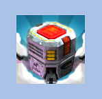

# Raw Image

The Raw Image control displays a non-interactive image to the user. This can be used for decoration, icons, etc, and the image can also be changed from a script to reflect changes in other controls. The control is similar to the Image control but does not have the same set of options for animating the image and accurately filing the control rectangle. However, the Raw Image can display any texture whilst the Image can only show a Sprite texture.

Raw Image 控件向用户显示一个非交互式的图像。这可以用于装饰、 图标等，图像也可 以从一个脚本来反映在其他控件中的更改。Raw Image 控件是类似于 image 控件，但并没有 关于图片动画的选项和准确地归档控制矩形。但是，Raw Image 可以显示任何纹理，image 只能显示一个精灵纹理

######A Raw Image control
##Properties

| Property:	 | Function: |
| -- | -- |
| Texture	 | The texture that represents the image to display. |
| Color	 | The color to apply to the image. |
| Material	 | The Material to use for rendering the image. |
| UV Rectangle	 | The image’s offset and size within the control rectangle, given in normalized coordinates (range 0.0 to 1.0). The edges of the image are stretched to fill the space around the UV rectangle. |
##Details

Since the Raw Image does not require a sprite texture, you can use it to display any texture available to the Unity player. For example, you might show an image downloaded from a URL using the WWW class or a texture from an object in a game.

由于 Raw Image 不需要一个精灵纹理，可用于可用显示任何纹理的 unity player。例如， 你可能会显示从某个 URL 下载的图像在游戏中使用 WWW 类或从对象的纹理。

The UV Rectangle properties allow you to display a small section of a larger image. The X and Y coordinates specify which part of the image is aligned with the bottom left corner of the control. For example, an X coordinate of 0.25 will cut off the leftmost quarter of the image. The W and H (ie, width and height) properties indicate the width and height of the section of image that will be scaled to fit the control rectangle. For example, a width and height of 0.5 will scale a quarter of the image area up to the control rectangle. By changing these properties, you can zoom and scale the image as desired (see also the Scrollbar control).

UV Rectangle 属性允许您显示一个较大的图像的一小部分。X 和 Y 坐标指定图像的哪 一部分与控件的左下角对齐。例如，X 坐标=0.25 图像的最左边将被切断。W 和 H （即宽 度和高度） 的属性指示的宽度和高度的一节将会缩放以适合的控制矩形的图像。例如，宽 度和高度的 0.5 将规模控件矩形图像面积的四分之一。通过改变这些属性，您可以缩放和 缩放该图像作为所需 （见也滚动条控件）。  