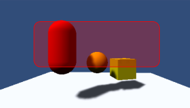

# Mask

A Mask is not a visible UI control but rather a way to modify the appearance of a control’s child elements. The mask restricts (ie, “masks”) the child elements to the shape of the parent. So, if the child is larger than the parent then only the part of the child that fits within the parent will be visible.

Mask 掩码是不可见的 UI 控件而是在修改控件的子元素的外观。掩码限制 （即， “masks”)  的子元素的父形状。所以，如果孩子是大于父，那么只有在父内的孩子的内容的 将可见。 

######Section of a large Image masked by a Panel (Scrollbars are separate controls)
##Properties

| Property:	 | Function: |
| -- | -- |
| Show Graphic	 | Should the graphic of the masking (parent) object be drawn with alpha over the child object? |
##Description

A common use of a Mask is to show a small section of a large Image, using say a Panel object (menu: GameObject > Create UI > Panel) as a “frame”. You can achieve this by firstly making the Image a child of the Panel object. You should position the Image so that the area that should be visible is directly behind the Panel area.

Mask 的一个常见用途是显示大 Image 的一小部分，使用说 Panel 对象 （menu: GameObject > Create UI > Panel） 作为一个“frame”。您可以通过首先使 Image 对象成为 Panel 子对象。你应该定位图像的区域，应是可见的是直接在面板区域后面。 

######Panel area shown in red with child Image behind
Then, add a Mask component to the Panel. The areas of the child Image outside the panel will become invisible since they are masked by the shape of the Panel.

######Masked areas shown faint, but would really be invisible
If the image is then moved around then only the part revealed by the Panel will be visible. The movement could be controlled by Scrollbars to create a scrollable viewer for a map, say.

##Implementation

Masking is implemented using the stencil buffer of the GPU.

The first Mask element writes a 1 to the stencil buffer All elements below the mask check when rendering, and only render to areas where there is a 1 in the stencil buffer *Nested Masks will write incremental bit masks into the buffer, this means that renderable children need to have the logical & of the stencil values to be rendered.