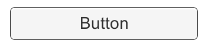

# Button

The Button control responds to a click from the user and is used to initiate or confirm an action. Familiar examples include the Submit and Cancel buttons used on web forms.

按钮控件响应单击，从用户用于启动或确认操作。熟悉的例子包括在 web 窗体上使用 的 Submit 提交和 Cancel 取消按钮。 

######A Button.

##Properties

| Property:	 | Function: |
| -- | -- |
| Interactable	 | Will this component will accept input? See Interactable. |
| Transition	 | Properties that determine the way the control responds visually to user actions. See Transition Options. |
| Navigation	 | Properties that determine the sequence of controls. See Navigation Options. |
##Events

| Property:	 | Function: |
| -- | -- |
| On Click	 | A UnityEvent that is invoked when when a user clicks the button and releases it. |
##Details

The button is designed to initiate an action when the user clicks and releases it. If the mouse is moved off the button control before the click is released, the action does not take place.

当用户单击并释放按钮它被设置为启动动作。如果单击释放之前，关闭按钮控制移动鼠 标，该操作不发生

The button has a single event called On Click that responds when the user completes a click. Typical use cases include:

该按钮具有一个单一的事件被称为 OnClick，当用户完成一次点击时的响应。典型使用 案例包括

* Confirming a decision (eg, starting gameplay or saving a game)
* Confirming 决定 （例如，开始游戏或保存游戏
* Moving to a sub-menu in a GUI
* Moving 到 GUI 中一个子菜单
* Cancelling an action in progress (eg, downloading a new scene)
* Cancelling 在进行的动作 （例如，下载一个新的场景