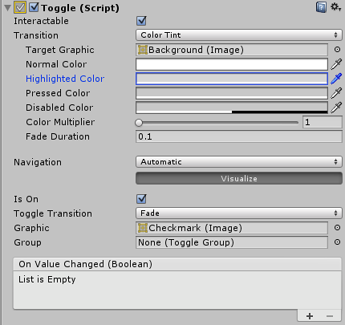

# Toggle

The Toggle control is a checkbox that allows the user to switch an option on or off.

######A Toggle.

##Properties

| Property:	 | Function: |
| -- | -- |
| Interactable	 | Will this component will accept input? See Interactable.
| Transition	 | Properties that determine the way the control responds visually to user actions. See Transition Options. |
| Navigation	 | Properties that determine the sequence of controls. See Navigation Options.
| Is On	 | Is the toggle switched on from the beginning? |
| Toggle Transition	 | The way the toggle reacts graphically when its value is changed. The options are None (ie, the checkmark simply appears or disappears) and Fade (ie, the checkmark fades in or out). |
| Graphic	 | The image used for the checkmark. |
| Group	 | The Toggle Group (if any) that this Toggle belongs to. |
##Events

| Property:	 | Function: |
| -- | -- |
| On Value Changed	 | A UnityEvent that is invoked when the Toggle is clicked. The event can send the current state as a bool type dynamic argument. |
##Details

The Toggle control allows the user to switch an option on or off. You can also combine several toggles into a Toggle Group in cases where only one of a set of options should be on at once.

The Toggle has a single event called On Value Changed that responds when the user changes the current value. The new value is passed to the event function as a boolean parameter. Typical use cases for Toggles include:

* Switching an option on or off (eg, playing music during a game).
* Letting the user confirm they have read a legal disclaimer.
* Choosing one of a set of options (eg, a day of the week) when used in a Toggle Group.

Note that the Toggle is a parent that provides a clickable area to children. If the Toggle has no children (or they are disabled) then it is not clickable.