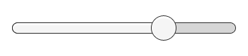

# Slider

The Slider control allows the user to select a numeric value from a predetermined range by dragging the mouse. Note that the similar ScrollBar control is used for scrolling rather tha selecting numeric values. Familiar examples include difficulty settings in games and brightness settings in image editors.

滑块控件允许用户通过拖动鼠标从一个预先确定的范围选择一个数字值。熟悉的例子包 括在游戏中困难设置和在图像编辑器中亮度设置

######A Slider.

##Properties

| Property:	 | Function: |
| -- | -- |
| Interactable	 | Will this component accept input? See Interactable. |
| Transition	 | Properties that determine the way the control responds visually to user actions. See Transition Options. |
| Navigation	 | Properties that determine the sequence of controls. See Navigation Options. |
| Fill Rect	 | The graphic used for the fill area of the control. |
| Handle Rect	 | The graphic used for the sliding “handle” part of the control |
| Direction	 | The direction in which the slider’s value will increase when the handle is dragged. The options are Left To Right, Right To Left, Bottom To Top and Top To Bottom. |
| Min Value	 | The value of the slider when the handle is at its extreme lower end (determined by the Direction property). |
| Max Value	 |  value of the slider when the handle is at its extreme upper end (determined by the Direction property). |
| Whole Numbers	 | Should the slider be constrained to integer values? |
| Value	 | Current numeric value of the slider. If the value is set in the inspector it will be used as the initial value, but this will change at runtime when the value changes. |
##Events

| Property:	 | Function: |
| -- | -- |
| On Value Changed	 |  UnityEvent that is invoked when the current value of the Slider has changed. The event can send the current value as a float type dynamic argument. The value is passed as a float type regardless of whether the Whole Numbers property is enabled. |
##Details

The value of a Slider is determined by the position of the handle along its length. The value increases from the Min Value up to the Max Value in proportion to the distance the handle is dragged. The default behaviour is for the slider to increase from left to right but it is also possible to reverse this behavior using the Direction property. You can also set the slider to increase vertically by selecting Bottom To Top or Top To Bottom for the Direction property.

滑块的值是由句柄的位置确定的。值从最小值到最大值处理拖动的距离的比例增加。默 认行为是为滑块以增加从左到右，但它也是可能扭转这种行为使用 Direction 方向属性。您 还可以设置滑块以垂直增加通过选择底部到顶部、顶部到底部的方向属性。 

The slider has a single event called On Value Changed that responds as the user drags the handle. The current numeric value of the slider is passed to the function as a float parameter. Typical use cases include:

滑块有一个单一的事件被称为 On Value Changed 响应当用户拖动句柄值改变时。滑块的 当前数值作为浮动参数传递给函数。典型使用案例包括： 

* Choosing a level of difficulty in a game, brightness of a light, etc.
* 选择 在游戏中的关卡难度、 亮度的光，等等。 
* Setting a distance, size, time or angle.