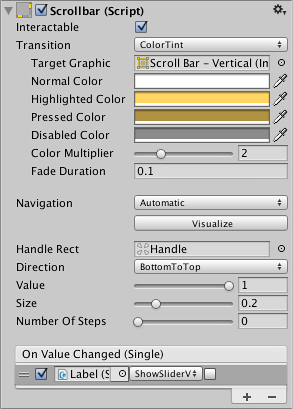

# Scrollbar

The Scrollbar control allows the user to scroll an image or other view that is too large to see completely. Note that the similar Slider control is used for selecting numeric values rather than scrolling. Familiar examples include the vertical Scrollbar at the side of a text editor and the vertical and horizontal pair of bars for viewing a section of a large image or map.

滚动条控件允许用户滚动图像或其他太大的，可以完全看到的视图。请注意类似的滑块 控件用于选择数字值，而不是滚动。熟悉的例子包括在一个文本编辑器的一侧和垂直和水平 两竖线用于查看较大的图像或地图的一个部分的垂直滚动条。 

######A Scrollbar.

##Properties

| Property:	 | Function: |
| -- | -- |
| Interactable	 | Will this component accept input? See Interactable. |
| Transition	 | Properties that determine the way the control responds visually to user actions. See Transition Options. |
| Navigation	 | Properties that determine the sequence of controls. See Navigation Options. |
| Fill Rect	 | The graphic used for the background area of the control. |
| Handle Rect	 | The graphic used for the sliding “handle” part of the control |
| Direction	 | The direction in which the Scrollbar’s value will increase when the handle is dragged. The options are Left To Right, Right To Left, Bottom To Top and Top To Bottom. |
| Value	 | Initial position value of the Scrollbar, in the range 0.0 to 1.0. |
| Size	 | Fractional size of the handle within the Scrollbar, in the range 0.0 to 1.0. |
| Number Of Steps	 | The number of distinct scroll positions allowed by the Scrollbar. |
##Events

| Property:	 | Function: |
| -- | -- |
| On Value Changed	 | A UnityEvent that is invoked when the current value of the Scrollbar changes. The event can send the value as a float type dynamic argument. |
##Details

The value of a Scrollbar is determined by the position of the handle along its length with the value being reported as a fraction between the extreme ends. For example, the default left-to-right bar has a value of 0.0 at the left end, 1.0 at the right end and 0.5 indicates the halfway point. A scrollbar can be oriented vertically by choosing Top To Bottom or Bottom To Top for the Direction property.

滚动条的值是由句柄的位置决定，与正在报告作为极端的两端之间的比例的值。例如， 默认从左到右的栏有一个值为 0.0 最左端，最右端 1.0 和 0.5 中间点。一个滚动条可以通 过选择垂直导向顶部到底部或顶部到底部的方向属性。 

A significant difference between the Scrollbar and the similar Slider control is that the Scrollbar’s handle can change in size to represent the distance of scrolling available; when the view can scroll only a short way, the handle will fill up most of the bar and only allow a slight shift either direction.

滚动条和类似的滑块控件之间的差异就是滚动条上的手柄可以改变的大小来表示距离 的滚动可用 ；当视图可以滚动，只有一小段路，该句柄将填补了大多数 bar 和一个轻微的 转变两个方向。 

The Scrollbar has a single event called On Value Changed that responds as the user drags the handle. The current value is passed to the even function as a float parameter. Typical use cases for a scrollbar include:

滚动条上有一个单一的事件被称为 On Value Changed 响应当用户拖动句柄的值。当前值 是作为一个 float 参数传递给偶函数。典型用例的一个滚动条，包括： 

* Scrolling a piece of text vertically.
* Scrolling a timeline horizontally.
* Used as a pair, scrolling a large image both horizontally and vertically to view a zoomed section. The size of the handle changes to indicate the degree of zooming and therefore the available distance for scrolling.
