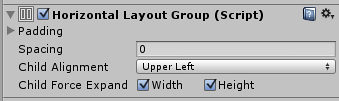

# Horizontal Layout Group

##Properties

| Property:	 | Function: |
| -- | -- |
| Padding	 | The padding inside the edges of the layout group. |
| Spacing	 | The spacing between the layout elements. |
| Child Alignment	 | The alignment to use for the child layout elements if they don’t fill out all the available space. |
| Child Force Expand	 | Whether to force the children to expand to fill additional available space. |
##Description

The Horizontal Layout Group component places its child layout elements next to each other, side by side. Their widths are determined by their respective minimum, preferred, and flexible widths according to the following model:

* The minimum widths of all the child layout elements are added together and the spacing between them is added as well. The result is the mimimum width of the Horizontal Layout Group.
* The preferred widths of all the child layout elements are added together and the spacing between them is added as well. The result is the preferred width of the Horizontal Layout Group.
* If the Horizontal Layout Group is at its minimum width or smaller, all the child layout elements will also have their minimum width.
* The closer the Horizontal Layout group is to its preferred width, the closer each child layout element will also get to their preferred width.
* If the Horizontal Layout Group is wider than its preferred width, it will distribute the extra available space proportionally to the child layout elements according to their respective flexible widths.