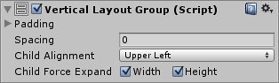

# Vertical Layout Group

##Properties

| Property:	 | Function: |
| -- | -- |
| Padding	 | The padding inside the edges of the layout group. |
| Spacing	 | The spacing between the layout elements. |
| Child Alignment	 | The alignment to use for the child layout elements if they don’t fill out all the available space. |
| Child Force Expand	 | Whether to force the children to expand to fill additional available space. |
##Description

The Vertical Layout Group component places its child layout elements on top of each other. Their heights are determined by their respective minimum, preferred, and flexible heights according to the following model:

* The minimum heights of all the child layout elements are added together and the spacing between them is added as well. The result is the mimimum height of the Vertical Layout Group.
* The preferred heights of all the child layout elements are added together and the spacing between them is added as well. The result is the preferred height of the Vertical Layout Group.
* If the Vertical Layout Group is at its minimum height or smaller, all the child layout elements will also have their minimum height.
* The closer the Vertical Layout group is to its preferred height, the closer each child layout element will also get to their preferred height.
* If the Vertical Layout Group is taller than its preferred height, it will distribute the extra available space proportionally to the child layout elements according to their respective flexible heights.