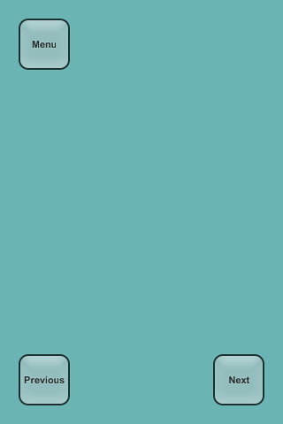
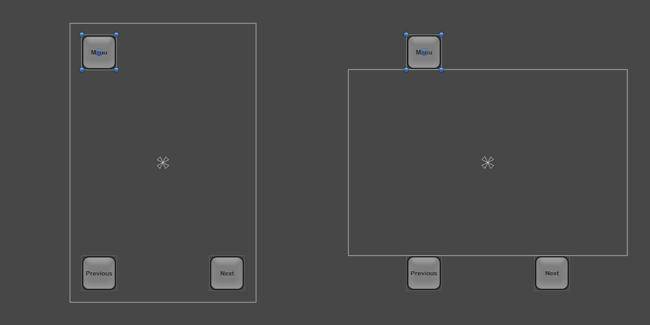
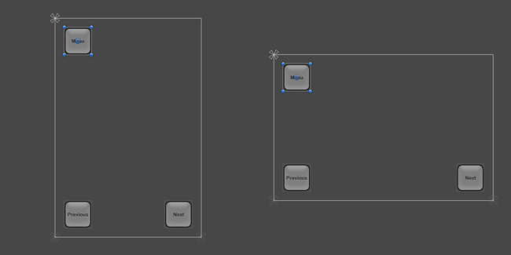
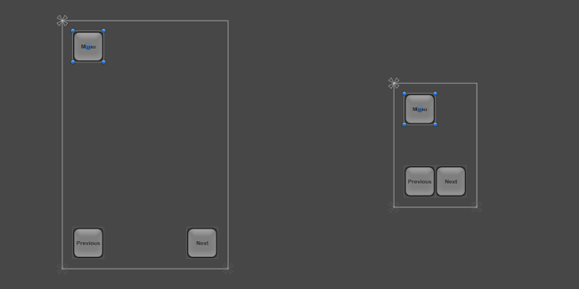
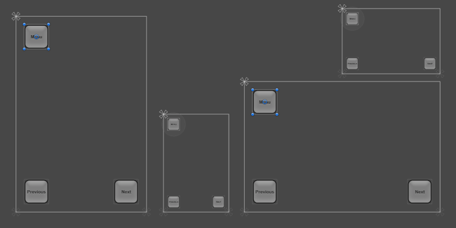

# Designing UI for Multiple Resolutions

Modern games and applications often need to support a wide variety of different screen resolutions and particularly UI layouts need to be able to adapt to that. The UI System in Unity includes a variety of tools for this purpose that can be combined in various ways.

现代的游戏和应用程序经常需要支持各种各样的不同的屏幕分辨率，特别是 UI 布局需 要能够适应这一点。unity 的 UI 系统包括各种工具为了这个目的，它可以和各种方式结合。

In this how-to we’re going to use a simple case study and look at and compare the different tools in the context of that. In our case study we have three buttons in the corners of the screen as shown below, and the goal is to adapt this layout to various resolutions.

在这个操作中我们要使用一个简单的案例研究，看着比较不同的工具在这个 context 上 下文。在我们的案例研究中，我们有三个按钮，如下所示，在屏幕的角落中，目标是要适应 这种布局的各中分辨率。 

For this how-to we’re going to consider four screen resolutions: Phone HD in portrait (640 x 960) and landscape (960 x 640) and Phone SD in portrait (320 x 480) and landscape (480 x 320). The layout is initially setup in the Phone HD Portrait resolution.

这个操作对于我们要考虑四个屏幕分辨率： Phone HD in portrait 电话高清画像 (640 × 960) 和 landscape 景观 （960 × 640） 和 Phone SD in portrait 手机 SD 肖像 (320 x 480） 和 landscape 风景 (480 × 320）。布局最初是 Phone HD Portrait 电话高清肖像的分 辨率。 

##Using anchors to adapt to different aspect ratios 使用锚点来适应不同的纵横比

UI elements are by default anchored to the center of the parent rectangle. This means that they keep a constant offset from the center.

UI 元素是默认定位到父矩形的中心。这意味着他们保持一个常数，到中心的偏移量。  

If the resolution is changed to a landscape aspect ratio with this setup, the buttons may not even be inside the rectangle of the screen anymore.

如果更改安装程序该分辨率 landscape 景观长宽比，按钮可能不在矩形的屏幕里面了。

One way to keep the buttons inside the screen is to change the layout such that the locations of the buttons are tied to their respective corners of the screen. The anchors of the top left button can be set to the upper left corner using the Anchors Preset drop down in the Inspector, or by dragging the triangular anchor handles in the Scene View. It’s best to do this while the current screen resolution set in the Game View is the one the layout is initially designed for, where the button placement looks correct. (See the UI Basic Layout page for more information on anchors.) Similarly, the anchors for the lower left and lower right buttons can be set to the lower left corner and lower right corner, respectively.

有一个方法是改变布局时按钮是依然在屏幕里面的，这样按钮的位置绑在他们各自在屏 幕的角落。可以在检查器中使用 Anchors Preset （锚点预设）下拉选择一个位置把 top left （左上）的按钮的锚点可以设置到 upper left（左上）角落上，或通过拖动三角形锚柄在拖到 场景视图左上角上。它是最好这样做，而在游戏视图中设置的当前屏幕分辨率是一个初始的 设计布局，按钮的布局看起来很正确。（见更多 UI Basic Layout 页面关于更多的锚点信息）。 同样地，（ lower left ）下左和（lower right）右下按钮可以分别设置为的左下角和右下角。

Once the buttons have been anchored to their respective corners, they stick to them when changing the resolution to a different aspect ratio.

一旦按钮已被锚定到其各自的角落，当更改屏幕分辨率不同的纵横比时他们依然坚持他 们自己位置。 

When the screen size is changed to a larger or smaller resolution, the buttons will also remain anchored to their respective corners. However, since they keep their original size as specified in pixels, they may take up a larger or smaller proportion of the screen. This may or may not be desirable, depending on how you would like your layout to behave on screens of different resolutions.

当屏幕大小更改为更大或更小的分辨率时，按钮将也仍将锚定到其各自的角落。然而， 由于他们保持其原来的大小作为以像素为单位指定，他们可能会占用更大或更小的屏幕比例 （就是按钮的大小完全没有缩放）。这可能会或可能不可取的，依赖于你想要你的布局在不 同的分辨率的屏幕上的行为。 

In this how-to, we know that the smaller resolutions of Phone SD Portrait and Landscape don’t correspond to screens that are physically smaller, but rather just screens with a lower pixel density. On these lower-density screens the buttons shouldn’t appear larger than on the high-density screens - they should instead appear with the same size.

在这个操作中，我们知道较小的分辨率 Phone SD Portrait 和 Landscape 不对应的物质 上较小的屏幕，但是较低的像素密度的屏幕。在这些低密度屏幕上的按钮应该显示比高密度 的屏幕上的内容大-----显示具有相同的大小他们应该相反。

This means that the buttons should become smaller by the same percentage as the screen is smaller. In other words, the scale of the buttons should follow the screen size. This is where the Canvas Scaler component can help.

这意味着相同百分比由于屏幕较小那么按钮应较小。换句话说，按钮的规模应遵循的屏 幕大小。这是 Reference Resolution component 组件可以帮助的地方。 

##Scaling with Screen Size

The Canvas Scaler component can be added to a root Canvas - a Game Object with a Canvas component on it, which all the UI elements are children of. It is also added by default when creating a new Canvas through the GameObject menu.

Reference Resolution 组件可以添加到 root Canvas 画布--一个游戏对象的画布组件上， 它将所有 UI 元素作为自己的子对象

In the Canvas Scaler component, you can set its UI Scale Mode to Scale With Screen Size. With this scale mode you can specify a resolution to use as reference. If the current screen resolution is smaller or larger than this reference resolution, the scale factor of the Canvas is set accordingly, so all the UI elements are scaled up or down together with the screen resolution.

Reference Resolution 组件中您可以指定一个分辨率作为参考。如果当前的屏幕分辨率 小于或大于此 reference resolution，画布上的 scale 因子设置 accordingly 相应地，所以所有 的 UI 元素与屏幕分辨率一起缩放。 

In our case, we set the Reference Resolution to be the Phone HD landscape resolution of 640 x 960. Now, when setting the screen resolution to the Phone SD portrait resolution of 320 x 480, the entire layout is scaled down so it appears proportionally the same as in full resolution. Everything is scaled down: The button sizes, their distances to the edges of the screen, the button graphics, and the text elements. This means that the layout will appear the same in the Phone SD portrait resolution as in Phone HD portrait; only with a lower pixel density.

在我们的例子中，我们设置参考分辨率是 Phone HD landscape 的 640 × 960。现在， 当将屏幕分辨率设置为 Phone SD portrait 的 320 x 480，整个布局是按比例缩小并按比例显 示与全分辨率相同。一切都按比例缩小： 按钮大小，它们的屏幕、 按钮图形和文本元素的 边缘之间的距离。这意味着布局在 Phone SD portrait 和 Phone HD portrait 上是相同的； 只 是用较低的像素密度了。

One thing to be aware of: After adding a Canvas Scaler component, it’s important to also check how the layout looks at other aspect ratios. By setting the resolution back to Phone HD landscape, we can see that the buttons now appear bigger than they should (and used to).

一件事要注意： 添加一个 Reference Resolution 组件后, 很重要的还要检查看看其他的 纵横比如何布局。现在设置该分辨率为 Phone HD landscape，我们可以看到按钮现在比刚刚 大了

The reason for the larger buttons in landscape aspect ratio comes down to how the Reference Resolution setting works. By default it compares the width or the current resolution with the width of the reference resolution and the result is used as the scale factor to scale everything with. Since the current landscape resolution of 960 x 640 has a 1.5 times larger width than the portrait reference resolution of 640 x 960, the layout is scaled up by 1.5.

在 landscape 纵横比下出现较大的按钮的原因归结为 Reference Resolution 组件是如何 工作。默认情况下它是比较当前分辨率的宽度和 reference resolution 的宽度，结果用作为 scale 因子来衡量一切。由于当前 landscape 的分辨率 960 × 640 比 portrait reference resolution 参考分辨率 640 × 960 有更大的宽度，布局的规模的扩大了 1.5 倍。

The component has a property called Match which can be 0 (Width), 1 (Height) or a value in between. By default it’s set to 0, which compares the current screen width with the reference resolution width as described.

reference resolution 参考分辨率具有一个属性称为 Match Width Or Height 值可以是 0 （宽度）、 1 （高度） 或在这两者之间的一个值。默认情况下它是设置为 0，将当前的屏 幕宽度参考分辨率宽度进行比较，如前所述。 

If the Match property is set to 0.5 instead, it will compare both the current width to the reference width and the current height to the reference height, and choose a scale factor that’s in between the two. Since in this case the landscape resolution is 1.5 times wider but also 1.5 times shorter, those two factor even out and produce a final scale factor of 1, which means the buttons keep their original size.

如果 Match Width Or Height 属性设置为 0.5 ，它将比较 reference 分辨率宽度与 current 分辨率宽度和 current 当前分辨率高度与 reference 引用分辨率高度两个，并在两个之间选 择 scale 因子。因为在这种情况下的 landscape resolution 是宽出 1.5 倍，但也短了 1.5 倍， 那这两个因子综合起来出来，最终产生 scale factor 为 1，这意味着这些按钮保持其原始大 小。 

At this point the layout supports all the four screen resolutions using a combination of appropriate anchoring and the Canvas Scaler component on the Canvas.

在这一点上布局支持所有四个屏幕分辨率，在画布上使用适当的锚定和 Reference Resolution 组件组合

See the Canvas Scaler reference page for more information on different ways to scale UI elements in relation to different screen sizes.