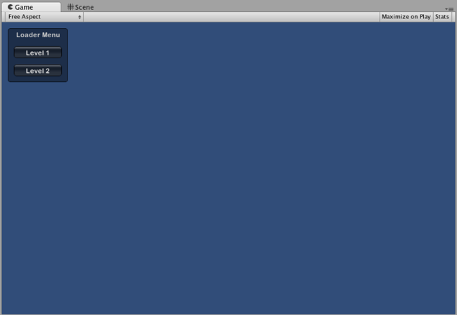
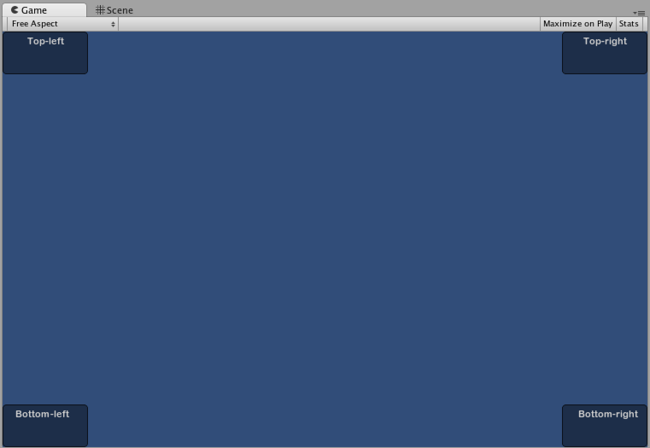
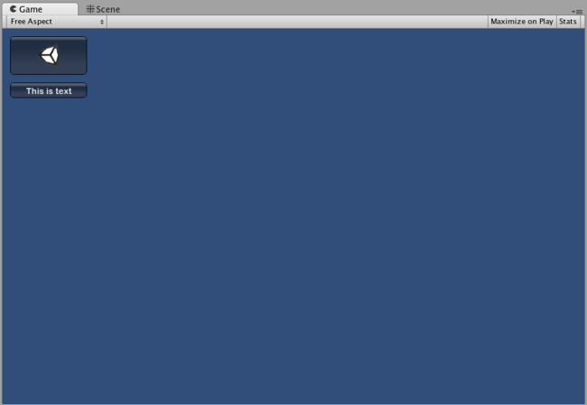

# IMGUI Basics

This section will explain the bare necessities for scripting Controls with Unity’s Immediate Mode GUI system (IMGUI).

##Making Controls with IMGUI

Unity’s IMGUI controls make use of a special function called OnGUI(). The OnGUI() function gets called every frame as long as the containing script is enabled - just like the Update() function.

UnityGUI 控件使用一种称为 OnGUI() 的特殊函数。只要包含的脚本已启用，每帧OnGUI() 函数都会被调用 - 正如 Update() 函数。

IMGUI controls themselves are very simple in structure. This structure is evident in the following example.

GUI 控件本身结构很简单。此结构在以下示例中较为清楚。

```
/* Example level loader */


// JavaScript
function OnGUI () {
    // Make a background box
    GUI.Box (Rect (10,10,100,90), "Loader Menu");

    // Make the first button. If it is pressed, Application.Loadlevel (1) will be executed
    if (GUI.Button (Rect (20,40,80,20), "Level 1")) {
        Application.LoadLevel (1);
    }

    // Make the second button.
    if (GUI.Button (Rect (20,70,80,20), "Level 2")) {
        Application.LoadLevel (2);
    }
}


//C#
using UnityEngine;
using System.Collections;

public class GUITest : MonoBehaviour {
            
    void OnGUI () {
        // Make a background box
        GUI.Box(new Rect(10,10,100,90), "Loader Menu");
    
        // Make the first button. If it is pressed, Application.Loadlevel (1) will be executed
        if(GUI.Button(new Rect(20,40,80,20), "Level 1")) {
            Application.LoadLevel(1);
        }
    
        // Make the second button.
        if(GUI.Button(new Rect(20,70,80,20), "Level 2")) {
            Application.LoadLevel(2);
        }
    }
}
```


This example is a complete, functional level loader. If you copy/paste this script and attach it a GameObject, you’ll see the following menu appear in when you enter Play Mode:

此示例是一个完整的功能性等级加载器。如果您复制/粘贴此脚本并将其贴到游戏对象 (GameObject) 上，则进入播放模式 (Play Mode) 时会看到以下菜单：


######The Loader Menu created by the example code
Let’s take a look at the details of the example code:

我们来看看示例代码的详细信息：

The first GUI line, GUI.Box (Rect (10,10,100,90), “Loader Menu”); displays a Box Control with the header text “Loader Menu”. It follows the typical GUI Control declaration scheme which we’ll explore momentarily.

第一行 GUI 命令行 GUI.Box (Rect (10,10,100,90), "Loader Menu"); 显示了带标题文本“Loader Menu”的盒 (Box) 控件。它遵循我们马上要讲解的典型 GUI 控件声明模式。

The next GUI line is a Button Control declaration. Notice that it is slightly different from the Box Control declaration. Specifically, the entire Button declaration is placed inside an if statement. When the game is running and the Button is clicked, this if statement returns true and any code inside the if block is executed.

下一行 GUI 是按钮 控件 (Button Control) 声明。注意它与盒控件 (Box Control) 声明有些许不同。特别是整个按钮 (Button) 声明都置于 if 语句内。如果在运行游戏时单击此按钮 (Button)，该 if 语句返回真值并执行 if 块内的任意代码。

Since the OnGUI() code gets called every frame, you don’t need to explicitly create or destroy GUI controls. The line that declares the Control is the same one that creates it. If you need to display Controls at specific times, you can use any kind of scripting logic to do so.

由于 OnGUI() 代码在每一帧获得调用，因此您不必明确创建或破坏 GUI 控件。声明该控件 (Control) 的行与创建它的行是同一行。如果您需要在特定时间显示控件 (Control)，可使用任何一种脚本逻辑来操作。

```
/* Flashing button example */


// JavaScript
function OnGUI () {
    if (Time.time % 2 < 1) {
        if (GUI.Button (Rect (10,10,200,20), "Meet the flashing button")) {
            print ("You clicked me!");
        }
    }
}


// C#
using UnityEngine;
using System.Collections;

public class GUITest : MonoBehaviour {
            
    void OnGUI () {
        if (Time.time % 2 < 1) {
            if (GUI.Button (new Rect (10,10,200,20), "Meet the flashing button")) {
                print ("You clicked me!");
            }
        }
    }
}
```


Here, GUI.Button() only gets called every other second, so the button will appear and disappear. Naturally, the user can only click it when the button is visible.

此处，GUI.Button() 仅每隔一秒获得调用，因此此按钮会出现然后消失。因此，只有在按钮可见时用户才能单击它。

As you can see, you can use any desired logic to control when GUI Controls are displayed and functional. Now we will explore the details of each Control’s declaration.

正如您所见，当 GUI 控件 (Control) 显示并可用时，您可使用任何需要的逻辑进行控制。现在我们来探究每个控件 (Control) 声明的详细信息。

##Anatomy of a Control

There are three key pieces of information required when declaring a GUI Control:

声明 GUI 控件 (Control) 时必需有三条关键信息：

Type (Position, Content)

类型 （位置、内容） 

Observe that this structure is a function with two arguments. We’ll explore the details of this structure now.

观察到此结构是一个有两个参数的函数。现在我们来探究此结构的详细信息。

###Type

Type is the Control Type, and is declared by calling a function in Unity’s GUI class or the GUILayout class, which is discussed at length in the Layout Modes section of the Guide. For example, GUI.Label() will create a non-interactive label. All the different control types are explained later, in the Controls section of the Guide.

类型 (Type) 是控件类型 (Control Type)，而且是通过调用 UnityGUI 类或 GUILayout 类 ,中的一个函数进行声明的。GUILayout 类将在指南的 布局模式 (Layout Modes) 部分进行详细讨论。例如，GUI.Label() 将创建一个非互动式的标签。所有不同的控件类型稍后会在指南的控件部分进行解释。

###Position

The Position is the first argument in any GUI Control function. The argument itself is provided with a Rect() function. Rect() defines four properties: left-most position, top-most position, total width, total height. All of these values are provided in integers, which correspond to pixel values. All UnityGUI controls work in Screen Space, which is the resolution of the published player in pixels.

位置 (Position) 是任何 GUI 控件 (Control) 函数中的第一个参数。参数本身设置有 Rect() 函数。Rect() 定义四种属性：最左端位置、最顶端位置、总宽度和总高度。所有这些值都是整数，这与像素值对应。所有 UnityGUI 控件都在屏幕空间 (Screen Space)中运行，该屏幕空间是以像素为单位的已发布播放器的分辨率

The coordinate system is top-left based. Rect(10, 20, 300, 100) defines a Rectangle that starts at coordinates: 10,20 and ends at coordinates 310,120. It is worth repeating that the second pair of values in Rect() are total width and height, not the coordinates where the controls end. This is why the example mentioned above ends at 310,120 and not 300,100.

坐标系统以左上角为基点。Rect(10, 20, 300, 100) 定义矩形 (Rectangle)，该矩形始于坐标：10,20，结束于坐标 310,120。还要重复一下，Rect() 中的第二对值是总宽度和高度，而非控件的结束坐标。这就是为什么上文提及示例的结束坐标是 310,120 而不是 300,100。

You can use the Screen.width and Screen.height properties to get the total dimensions of the screen space available in the player. The following example may help clarify how this is done:

使用Screen.width 和 Screen.height 属性可使屏幕空间的总尺寸在播放器中可用。以下示例可能有助于阐明其完成方式：

```
/* Screen.width & Screen.height example */


// JavaScript
function OnGUI () {
    GUI.Box (Rect (0,0,100,50), "Top-left");
    GUI.Box (Rect (Screen.width - 100,0,100,50), "Top-right");
    GUI.Box (Rect (0,Screen.height - 50,100,50), "Bottom-left");
    GUI.Box (Rect (Screen.width - 100,Screen.height - 50,100,50), "Bottom-right");
}


// C#
using UnityEngine;
using System.Collections;

public class GUITest : MonoBehaviour {
            
    void OnGUI(){
        GUI.Box (new Rect (0,0,100,50), "Top-left");
        GUI.Box (new Rect (Screen.width - 100,0,100,50), "Top-right");
        GUI.Box (new Rect (0,Screen.height - 50,100,50), "Bottom-left");
        GUI.Box (new Rect (Screen.width - 100,Screen.height - 50,100,50), "Bottom-right");
    }

}
```


######The Boxes positioned by the above example
###Content

The second argument for a GUI Control is the actual content to be displayed with the Control. Most often you will want to display some text or an image on your Control. To display text, pass a string as the Content argument like this:

用于 GUI 控件 (Control) 的第二个参数是用控件 (Control) 显示的实际内容。很多时候您需要在控件 (Control) 上显示某个文本或图像。如需显示文本，请将字符串作为内容 (Content) 参数进行传递，如下所示：

```
/* String Content example */


// JavaScript
function OnGUI () {
    GUI.Label (Rect (0,0,100,50), "This is the text string for a Label Control");
}


// C#
using UnityEngine;
using System.Collections;

public class GUITest : MonoBehaviour {
            
    void OnGUI () {
        GUI.Label (new Rect (0,0,100,50), "This is the text string for a Label Control");
    }

}
```


To display an image, declare a Texture2D public variable, and pass the variable name as the content argument like this:

```
/* Texture2D Content example */


// JavaScript
var controlTexture : Texture2D;

function OnGUI () {
    GUI.Label (Rect (0,0,100,50), controlTexture);
}


// C#
public Texture2D controlTexture;
  ...

void OnGUI () {
    GUI.Label (new Rect (0,0,100,50), controlTexture);
}
```


Here is an example closer to a real-world scenario:

```
/* Button Content examples */


// JavaScript
var icon : Texture2D;

function OnGUI () {
    if (GUI.Button (Rect (10,10, 100, 50), icon)) {
        print ("you clicked the icon");
    }

    if (GUI.Button (Rect (10,70, 100, 20), "This is text")) {
        print ("you clicked the text button");
    }
}


// C#
using UnityEngine;
using System.Collections;

public class GUITest : MonoBehaviour {
                
    public Texture2D icon;
    
    void OnGUI () {
        if (GUI.Button (new Rect (10,10, 100, 50), icon)) {
            print ("you clicked the icon");
        }
    
        if (GUI.Button (new Rect (10,70, 100, 20), "This is text")) {
            print ("you clicked the text button");
        }
    }

}
```



######The Buttons created by the above example
There is a third option which allows you to display images and text together in a GUI Control. You can provide a GUIContent object as the Content argument, and define the string and image to be displayed within the GUIContent.

```
/* Using GUIContent to display an image and a string */


// JavaScript
var icon : Texture2D;

function OnGUI () {
    GUI.Box (Rect (10,10,100,50), GUIContent("This is text", icon));
}


// C#
using UnityEngine;
using System.Collections;

public class GUITest : MonoBehaviour {
                
    public Texture2D icon;

    void OnGUI () {
        GUI.Box (new Rect (10,10,100,50), new GUIContent("This is text", icon));
    }

}
```


You can also define a Tooltip in the GUIContent, and display it elsewhere in the GUI when the mouse hovers over it.

```
/* Using GUIContent to display a tooltip */


// JavaScript
function OnGUI () {
    // This line feeds "This is the tooltip" into GUI.tooltip
    GUI.Button (Rect (10,10,100,20), GUIContent ("Click me", "This is the tooltip"));
    // This line reads and displays the contents of GUI.tooltip
    GUI.Label (Rect (10,40,100,20), GUI.tooltip);
}


// C#
using UnityEngine;
using System.Collections;

public class GUITest : MonoBehaviour {
                    
    void OnGUI () {
        // This line feeds "This is the tooltip" into GUI.tooltip
        GUI.Button (new Rect (10,10,100,20), new GUIContent ("Click me", "This is the tooltip"));
        
        // This line reads and displays the contents of GUI.tooltip
        GUI.Label (new Rect (10,40,100,20), GUI.tooltip);
    }

}
```


If you’re daring you can also use GUIContent to display a string, an icon, and a tooltip!

```
/* Using GUIContent to display an image, a string, and a tooltip */


// JavaScript
var icon : Texture2D;

function OnGUI () {
    GUI.Button (Rect (10,10,100,20), GUIContent ("Click me", icon, "This is the tooltip"));
    GUI.Label (Rect (10,40,100,20), GUI.tooltip);
}


// C#
using UnityEngine;
using System.Collections;

public class GUITest : MonoBehaviour {
                    
    public Texture2D icon;
    
    void OnGUI () {
        GUI.Button (new Rect (10,10,100,20), new GUIContent ("Click me", icon, "This is the tooltip"));
        GUI.Label (new Rect (10,40,100,20), GUI.tooltip);
    }

}
```


The script reference page for the GUIContent constructor has some examples of its use.