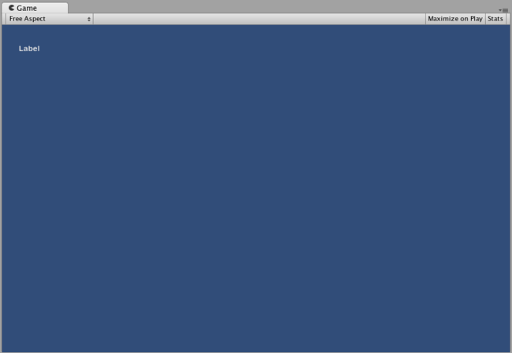
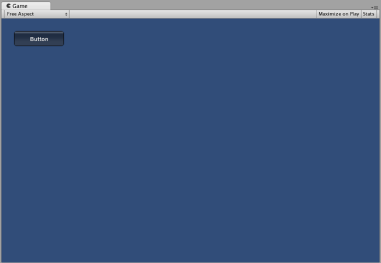
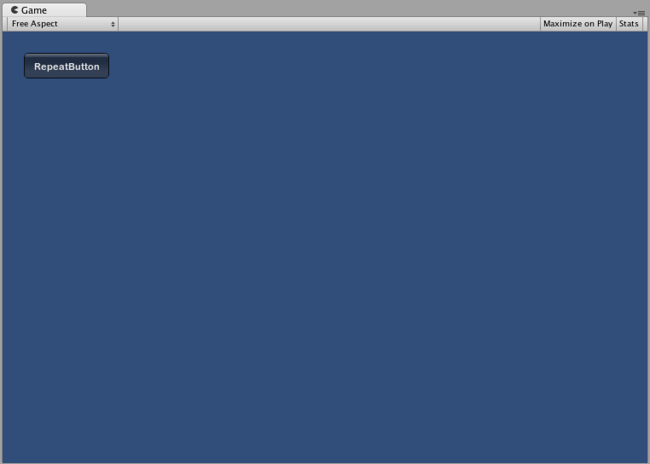
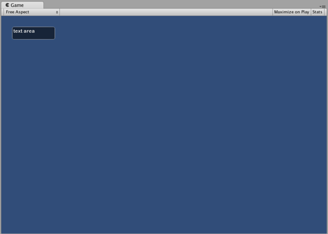
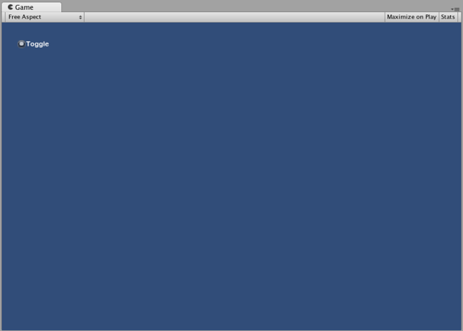

# Controls

##IMGUI Control Types

There are a number of different IMGUI Controls that you can create. This section lists all of the available display and interactive Controls. There are other IMGUI functions that affect layout of Controls, which are described in the Layout section of the Guide.

您可以创建多种不同的 GUI 控件 (Control) 。本节列出了所有的可用显示控件和交互式控件。本指南的布局一节还描述了影响控件 (Control) 布局的其他 GUI 功能。
###Label

The Label is non-interactive. It is for display only. It cannot be clicked or otherwise moved. It is best for displaying information only.

标签 (Label) 是非互动式的。其仅用于显示。不能点击或移动标签 (Label)。标签 (Label) 仅适合用于显示信息。

```
/* GUI.Label example */


// JavaScript
function OnGUI () {
    GUI.Label (Rect (25, 25, 100, 30), "Label");
}


// C#
using UnityEngine;
using System.Collections;

public class GUITest : MonoBehaviour {
                    
    void OnGUI () {
        GUI.Label (new Rect (25, 25, 100, 30), "Label");
    }

}
```


######The Label created by the example code

###Button

The Button is a typical interactive button. It will respond a single time when clicked, no matter how long the mouse remains depressed. The response occurs as soon as the mouse button is released.

按钮 (Button) 是典型的互动式按钮。无论按住鼠标多久，单击按钮 (Button) 后，它都将响应一次。只要一松开鼠标按钮就会发生响应。

####Basic Usage

In UnityGUI, Buttons will return true when they are clicked. To execute some code when a Button is clicked, you wrap the the GUI.Button function in an if statement. Inside the if statement is the code that will be executed when the Button is clicked.

在 UnityGUI 中，单击“按钮” (Button) 后，它将返回真。如需在单击“按钮” (Button) 后执行代码，您可以将 GUI.Button 函数放入 if 语句中。在单击“按钮” (Button) 后将执行存在于if 语句中的代码。

```
/* GUI.Button example */


// JavaScript
function OnGUI () {
    if (GUI.Button (Rect (25, 25, 100, 30), "Button")) {
        // This code is executed when the Button is clicked
    }
}


// C#
using UnityEngine;
using System.Collections;

public class GUITest : MonoBehaviour {
                    
    void OnGUI () {
        if (GUI.Button (new Rect (25, 25, 100, 30), "Button")) {
            // This code is executed when the Button is clicked
        }
    }

}
```



######The Button created by the example code

###RepeatButton

RepeatButton is a variation of the regular Button. The difference is, RepeatButton will respond every frame that the mouse button remains depressed. This allows you to create click-and-hold functionality.

重复按钮 (RepeatButton) 是常规按钮 (Button) 的变型。不同之处在于，重复按钮 (RepeatButton) 将在每帧按压鼠标按钮期间作出响应。这使您可以创建“单击并按住” (click-and-hold) 功能。

####Basic Usage

In UnityGUI, RepeatButtons will return true for every frame that they are clicked. To execute some code while the Button is being clicked, you wrap the the GUI.RepeatButton function in an if statement. Inside the if statement is the code that will be executed while the RepeatButton remains clicked.

在 UnityGUI 中，“重复按钮” (RepeatButton) 将对点击它们时的每个帧返回 true 。如需在点击“按钮” (Button) 时执行代码，您可以将 GUI.RepeatButton 函数放入 if语句中。在保持点击“重复按钮” (RepeatButton) 期间将执行 if 语句中的代码。

```
/* GUI.RepeatButton example */


// JavaScript
function OnGUI () {
    if (GUI.RepeatButton (Rect (25, 25, 100, 30), "RepeatButton")) {
        // This code is executed every frame that the RepeatButton remains clicked
    }
}


// C#
using UnityEngine;
using System.Collections;

public class GUITest : MonoBehaviour {
                    
    void OnGUI () {
        if (GUI.RepeatButton (new Rect (25, 25, 100, 30), "RepeatButton")) {
            // This code is executed every frame that the RepeatButton remains clicked
        }
    }

}
```


######The Repeat Button created by the example code
###TextField

The TextField Control is an interactive, editable single-line field containing a text string.

文本框 (TextField 控件是一种互动式、可编辑的单行字段，含有文本字符串。

####Basic Usage

The TextField will always display a string. You must provide the string to be displayed in the TextField. When edits are made to the string, the TextField function will return the edited string.

“文本框” (TextField) 始终显示字符串。您必须在“文本框” (TextField) 中提供 待显示的字符串。在编辑字符串时，“文本框” (TextField) 函数将返回已编辑的字符串。

```
/* GUI.TextField example */


// JavaScript
var textFieldString = "text field";

function OnGUI () {
    textFieldString = GUI.TextField (Rect (25, 25, 100, 30), textFieldString);
}


// C#
using UnityEngine;
using System.Collections;

public class GUITest : MonoBehaviour {
                    
    private string textFieldString = "text field";
    
    void OnGUI () {
        textFieldString = GUI.TextField (new Rect (25, 25, 100, 30), textFieldString);
    }

}
```


######The TextField created by the example code
###TextArea

The TextArea Control is an interactive, editable multi-line area containing a text string.

文本区 (TextArea) 控件是一种互动式、可编辑的多行区域，含有文本字符串。

####Basic Usage

The TextArea will always display a string. You must provide the string to be displayed in the TextArea. When edits are made to the string, the TextArea function will return the edited string.

“文本区” (TextArea) 始终显示字符串。您必须在“文本区” (TextArea) 中提供 待显示的字符串。在编辑字符串时，“文本区” (TextArea) 函数将返回已编辑的字符串。

```
/* GUI.TextArea example */


// JavaScript
var textAreaString = "text area";

function OnGUI () {
    textAreaString = GUI.TextArea (Rect (25, 25, 100, 30), textAreaString);
}


// C#
using UnityEngine;
using System.Collections;

public class GUITest : MonoBehaviour {
                    
    private string textAreaString = "text area";
    
    void OnGUI () {
        textAreaString = GUI.TextArea (new Rect (25, 25, 100, 30), textAreaString);
    }

}

```


######The TextArea created by the example code
###Toggle

The Toggle Control creates a checkbox with a persistent on/off state. The user can change the state by clicking on it.

“切换键” (Toggle) 切换键 (Toggle) 控件创建具有持续的开/关状态的复选框。用户可通过单击复选框来改变其状态。

####Basic Usage

The Toggle on/off state is represented by a true/false boolean. You must provide the boolean as a parameter to make the Toggle represent the actual state. The Toggle function will return a new boolean value if it is clicked. In order to capture this interactivity, you must assign the boolean to accept the return value of the Toggle function.

“切换键” (Toggle) 的开/关状态由真/假布尔值表示。您必须提供 布尔值作为参数，使“切换键” (Toggle) 代表实际状态。点击“切换键”(Toggle) 时，切换键函数将返回一个新的布尔值。要获得此互动性，您必须指定布尔型变量接受“切换键” (Toggle) 函数的返回值。
```

/* GUI.Toggle example */


// JavaScript
var toggleBool = true;

function OnGUI () {
    toggleBool = GUI.Toggle (Rect (25, 25, 100, 30), toggleBool, "Toggle");
}


// C#
using UnityEngine;
using System.Collections;

public class GUITest : MonoBehaviour {
                    
    private bool toggleBool = true;
    
    void OnGUI () {
        toggleBool = GUI.Toggle (new Rect (25, 25, 100, 30), toggleBool, "Toggle");
    }

}
```



######The Toggle created by the example code
###Toolbar

The Toolbar Control is essentially a row of Buttons. Only one of the Buttons on the Toolbar can be active at a time, and it will remain active until a different Button is clicked. This behavior emulates the behavior of a typical Toolbar. You can define an arbitrary number of Buttons on the Toolbar.

工具栏 (Toolbar) 控件实际上就是一排按钮 (Button)。一次只可激活“工具栏”(Toolbar) 上的一个“按钮”(Button)，且在单击另一个“按钮”(Button) 之前，该按钮将保持激活状态。这种行为是效仿经典“工具栏”(Toolbar) 的行为。您可以在“工具栏”(Toolbar) 上定义任意数目的“按钮”(Button)。

####Basic Usage

The active Button in the Toolbar is tracked through an integer. You must provide the integer as an argument in the function. To make the Toolbar interactive, you must assign the integer to the return value of the function. The number of elements in the content array that you provide will determine the number of Buttons that are shown in the Toolbar.

通过一个整数可跟踪“工具栏”(Toolbar) 中激活的“按钮”(Button)。您必须提供 该整数作为此函数的参数。要使“工具栏”(Toolbar) 变为互动式的，则必须将该整数指定为函数的返回值。您提供 的内容数组中的元素数目将决定“工具栏” (Toolbar) 中显示的“按钮” (Button) 的数目。

```
/* GUI.Toolbar example */


// JavaScript
var toolbarInt = 0;
var toolbarStrings : String[] = ["Toolbar1", "Toolbar2", "Toolbar3"];

function OnGUI () {
    toolbarInt = GUI.Toolbar (Rect (25, 25, 250, 30), toolbarInt, toolbarStrings);
}


// C#
using UnityEngine;
using System.Collections;

public class GUITest : MonoBehaviour {
                    
    private int toolbarInt = 0;
    private string[] toolbarStrings = {"Toolbar1", "Toolbar2", "Toolbar3"};
    
    void OnGUI () {
        toolbarInt = GUI.Toolbar (new Rect (25, 25, 250, 30), toolbarInt, toolbarStrings);
    }

}

```


######The Toolbar created by the example code
###SelectionGrid

The SelectionGrid Control is a multi-row Toolbar. You can determine the number of columns and rows in the grid. Only one Button can be active at time.

栅格选择 (SelectionGrid) 控件是多排工具栏 (Toolbar)。您可以决定栅格中的列数和行数。一次仅可激活一个“按钮”(Button)。

####Basic Usage

The active Button in the SelectionGrid is tracked through an integer. You must provide the integer as an argument in the function. To make the SelectionGrid interactive, you must assign the integer to the return value of the function. The number of elements in the content array that you provide will determine the number of Buttons that are shown in the SelectionGrid. You also can dictate the number of columns through the function arguments.

通过一个整数可跟踪“栅格选择”(SelectionGrid) 中激活的“按钮”(Button)。您必须提供 该整数作为此函数的参数。要使“栅格选择”(SelectionGrid) 变为互动式的，则必须指定该整数为函数的返回值。您提供 的内容数组中的元素数目将决定“栅格选择”(SelectionGrid) 中显示的“按钮” (Button) 的数目。您可以通过函数参数确定列数。
```

/* GUI.SelectionGrid example */


// JavaScript
var selectionGridInt : int = 0;
var selectionStrings : String[] = ["Grid 1", "Grid 2", "Grid 3", "Grid 4"];

function OnGUI () {
    selectionGridInt = GUI.SelectionGrid (Rect (25, 25, 100, 30), selectionGridInt, selectionStrings, 2);

}


// C#
using UnityEngine;
using System.Collections;

public class GUITest : MonoBehaviour {
                    
    private int selectionGridInt = 0;
    private string[] selectionStrings = {"Grid 1", "Grid 2", "Grid 3", "Grid 4"};
    
    void OnGUI () {
        selectionGridInt = GUI.SelectionGrid (new Rect (25, 25, 300, 60), selectionGridInt, selectionStrings, 2);
    
    }

}

```


######The SelectionGrid created by the example code
###HorizontalSlider

The HorizontalSlider Control is a typical horizontal sliding knob that can be dragged to change a value between predetermined min and max values.

水平滑动条 (HorizontalSlider) 控件是典型的水平滑动钮，可通过拖动在预定最小值和最大值之间改变值的大小。

####Basic Usage

The position of the Slider knob is stored as a float. To display the position of the knob, you provide that float as one of the arguments in the function. There are two additional values that determine the minimum and maximum values. If you want the slider knob to be adjustable, assign the slider value float to be the return value of the Slider function.

“滑动条”(Slider) 钮的位置以浮点数形式存储。要显示该钮的位置，您需要提供 该浮点数作为函数的参数。另有两个值用于确定最小值和最大值。如果希望滑动条钮是可调的，则将滑动条值浮点数指定为“滑动条"(Slider) 函数的返回值。

```
/* Horizontal Slider example */


// JavaScript
var hSliderValue : float = 0.0;

function OnGUI () {
    hSliderValue = GUI.HorizontalSlider (Rect (25, 25, 100, 30), hSliderValue, 0.0, 10.0);
}


// C#
using UnityEngine;
using System.Collections;

public class GUITest : MonoBehaviour {
                    
    private float hSliderValue = 0.0f;
    
    void OnGUI () {
        hSliderValue = GUI.HorizontalSlider (new Rect (25, 25, 100, 30), hSliderValue, 0.0f, 10.0f);
    }

}

```


######The Horizontal Slider created by the example code
###VerticalSlider

The VerticalSlider Control is a typical vertical sliding knob that can be dragged to change a value between predetermined min and max values.

垂直滑块 (VerticalSlider) 控件是典型的垂直滑动钮，可通过拖动在预定最小值和最大值之间改变值的大小。

####Basic Usage

The position of the Slider knob is stored as a float. To display the position of the knob, you provide that float as one of the arguments in the function. There are two additional values that determine the minimum and maximum values. If you want the slider knob to be adjustable, assign the slider value float to be the return value of the Slider function.

“滑块”(Slider) 钮的位置以浮点数形式存储。要显示该钮的位置，您需要提供 该浮点数作为函数的参数。另有两个值用于确定最小值和最大值。如果希望滑块钮是可调的，则将滑块值浮点数指定为“滑块"(Slider) 函数的返回值。

```
/* Vertical Slider example */


// JavaScript
var vSliderValue : float = 0.0;

function OnGUI () {
    vSliderValue = GUI.VerticalSlider (Rect (25, 25, 100, 30), vSliderValue, 10.0, 0.0);
}


// C#
using UnityEngine;
using System.Collections;

public class GUITest : MonoBehaviour {
                    
    private float vSliderValue = 0.0f;
    
    void OnGUI () {
        vSliderValue = GUI.VerticalSlider (new Rect (25, 25, 100, 30), vSliderValue, 10.0f, 0.0f);
    }

}
```


######The Vertical Slider created by the example code
###HorizontalScrollbar

The HorizontalScrollbar Control is similar to a Slider Control, but visually similar to Scrolling elements for web browsers or word processors. This control is used to navigate the ScrollView Control.

水平滚动条 (HorizontalScrollbar) 控件与滑动条 (Slider) 控件类似，但视觉上更像是网页浏览器或文字处理器的滚动元素。此控件用于导航滚动视图 (ScrollView) 控件。

####Basic Usage

Horizontal Scrollbars are implemented identically to Horizontal Sliders with one exception: There is an additional argument which controls the width of the Scrollbar knob itself.

“水平滚动条”(HorizontalScrollbar) 的执行与“水平滑动条”(Horizontal Slider) 相同，但有一个例外之处：另有一个参数控制“滚动条”(Scrollbar) 钮自身的宽度。

```
/* Horizontal Scrollbar example */


// JavaScript
var hScrollbarValue : float;

function OnGUI () {
    hScrollbarValue = GUI.HorizontalScrollbar (Rect (25, 25, 100, 30), hScrollbarValue, 1.0, 0.0, 10.0);
}


// C#
using UnityEngine;
using System.Collections;

public class GUITest : MonoBehaviour {
                    
    private float hScrollbarValue;
    
    void OnGUI () {
        hScrollbarValue = GUI.HorizontalScrollbar (new Rect (25, 25, 100, 30), hScrollbarValue, 1.0f, 0.0f, 10.0f);
    }

}
```


######The Horizontal Scrollbar created by the example code
###VerticalScrollbar

The VerticalScrollbar Control is similar to a Slider Control, but visually similar to Scrolling elements for web browsers or word processors. This control is used to navigate the ScrollView Control.

垂直滚动条 (VerticalScrollbar) 控件与 滑动条 (Slider) 控件类似，但视觉上更像网页浏览器或文字处理器的滚动元素。此控件用于导航 滚动视图 (ScrollView) 控件。

####Basic Usage

Vertical Scrollbars are implemented identically to Vertical Sliders with one exception: There is an additional argument which controls the height of the Scrollbar knob itself.

“垂直滚动条”(Vertical Scrollbar) 的执行与“垂直滑动条”(Vertical Slider) 相同，但有一个例外之处：另有一个参数控制“滚动条”(Scrollbar) 钮自身的高度。
```

/* Vertical Scrollbar example */


// JavaScript
var vScrollbarValue : float;

function OnGUI () {
    vScrollbarValue = GUI. VerticalScrollbar (Rect (25, 25, 100, 30), vScrollbarValue, 1.0, 10.0, 0.0);
}


// C#
using UnityEngine;
using System.Collections;

public class GUITest : MonoBehaviour {
                    
    private float vScrollbarValue;
    
    void OnGUI () {
        vScrollbarValue = GUI. VerticalScrollbar (new Rect (25, 25, 100, 30), vScrollbarValue, 1.0f, 10.0f, 0.0f);
    }

}

```


######The Vertical Scrollbar created by the example code
###ScrollView

ScrollViews are Controls that display a viewable area of a much larger set of Controls.

滚动视图 (ScrollView) 是显示较大控件组的可视区域的控件。

####Basic Usage

ScrollViews require two Rects as arguments. The first Rect defines the location and size of the viewable ScrollView area on the screen. The second Rect defines the size of the space contained inside the viewable area. If the space inside the viewable area is larger than the viewable area, Scrollbars will appear as appropriate. You must also assign and provide a 2D Vector which stores the position of the viewable area that is displayed.

“滚动视图”(ScrollView) 需要两个 Rects作为参数。第一个 Rect 定义屏幕上的可视“滚动视图”(ScrollView) 区域的位置和大小。第二个 Rect 定义该可视区域内部的空间大小。如果该可视区域内部的空间大于该可视区域，“滚动条”(Scrollbar) 根据情况适当地显示出来。您还必须分配并提供 一个存储所显示的可视区域位置的二维向量 (2D Vector)。
```

/* ScrollView example */


// JavaScript
var scrollViewVector : Vector2 = Vector2.zero;
var innerText : String = "I am inside the ScrollView";

function OnGUI () {
    // Begin the ScrollView
    scrollViewVector = GUI.BeginScrollView (Rect (25, 25, 100, 100), scrollViewVector, Rect (0, 0, 400, 400));

    // Put something inside the ScrollView
    innerText = GUI.TextArea (Rect (0, 0, 400, 400), innerText);

    // End the ScrollView
    GUI.EndScrollView();
}


// C#
using UnityEngine;
using System.Collections;

public class GUITest : MonoBehaviour {
                    
    private Vector2 scrollViewVector = Vector2.zero;
    private string innerText = "I am inside the ScrollView";
    
    void OnGUI () {
        // Begin the ScrollView
        scrollViewVector = GUI.BeginScrollView (new Rect (25, 25, 100, 100), scrollViewVector, new Rect (0, 0, 400, 400));
    
        // Put something inside the ScrollView
        innerText = GUI.TextArea (new Rect (0, 0, 400, 400), innerText);
    
        // End the ScrollView
        GUI.EndScrollView();
    }

}
```


######The ScrollView created by the example code
###Window

Windows are drag-able containers of Controls. They can receive and lose focus when clicked. Because of this, they are implemented slightly differently from the other Controls. Each Window has an id number, and its contents are declared inside a separate function that is called when the Window has focus.

窗口 (Window) 是控件的可拖动容器。点击时，窗口会获得焦点或失去焦点。因此，它们的执行与其他控件略有不同。每个“窗口”(Window) 都有一个id 号，当“窗口”(Window) 获得焦点时，其内容在调用的独立函数内声明。

####Basic Usage

Windows are the only Control that require an additional function to work properly. You must provide an id number and a function name to be executed for the Window. Inside the Window function, you create your actual behaviors or contained Controls.

“窗口”(Window) 是唯一一个需要附加函数来实现正确运行的控件。您必须提供 一个 id 号和对该“窗口”(Window) 执行的函数名。在“窗口”(Window) 函数中，您可以创建您的实际行为或包含的控件。
```

/* Window example */


// JavaScript
var windowRect : Rect = Rect (20, 20, 120, 50);

function OnGUI () {
    windowRect = GUI.Window (0, windowRect, WindowFunction, "My Window");
}

function WindowFunction (windowID : int) {
    // Draw any Controls inside the window here
}


// C#
using UnityEngine;
using System.Collections;

public class GUITest : MonoBehaviour {
                    
    private Rect windowRect = new Rect (20, 20, 120, 50);
    
    void OnGUI () {
        windowRect = GUI.Window (0, windowRect, WindowFunction, "My Window");
    }
    
    void WindowFunction (int windowID) {
        // Draw any Controls inside the window here
    }

}

```


######The Window created by the example code
###GUI.changed

To detect if the user did any action in the GUI (clicked a button, dragged a slider, etc), read the GUI.changed value from your script. This gets set to true when the user has done something, making it easy to validate the user input.

要检测用户是否对 GUI 进行过操作（如点击“按钮”(Button)、拖动滑动条等等），请从脚本读取 GUI.changed 值。用户进行过操作的情况下，该值设定为 true，因此很容易证实用户的输入。

A common scenario would be for a Toolbar, where you want to change a specific value based on which Button in the Toolbar was clicked. You don’t want to assign the value in every call to OnGUI(), only when one of the Buttons has been clicked.

```
/* GUI.changed example */


// JavaScript
private var selectedToolbar : int = 0;
private var toolbarStrings = ["One", "Two"];

function OnGUI () {
    // Determine which button is active, whether it was clicked this frame or not
    selectedToolbar = GUI.Toolbar (Rect (50, 10, Screen.width - 100, 30), selectedToolbar, toolbarStrings);

    // If the user clicked a new Toolbar button this frame, we'll process their input
    if (GUI.changed)
    {
        print ("The toolbar was clicked");

        if (selectedToolbar == 0)
        {
            print ("First button was clicked");
        }
        else
        {
            print ("Second button was clicked");
        }
    }
}


// C#
using UnityEngine;
using System.Collections;

public class GUITest : MonoBehaviour {
                    
    private int selectedToolbar = 0;
    private string[] toolbarStrings = {"One", "Two"};
    
    void OnGUI () {
        // Determine which button is active, whether it was clicked this frame or not
        selectedToolbar = GUI.Toolbar (new Rect (50, 10, Screen.width - 100, 30), selectedToolbar, toolbarStrings);
    
        // If the user clicked a new Toolbar button this frame, we'll process their input
        if (GUI.changed)
        {
            Debug.Log("The toolbar was clicked");
    
            if (0 == selectedToolbar)
            {
                Debug.Log("First button was clicked");
            }
            else
            {
                Debug.Log("Second button was clicked");
            }
        }
    }

}
```


GUI.changed will return true if any GUI Control placed before it was manipulated by the user.