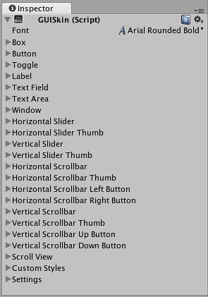

# Customization

##Customizing your IMGUI Controls

Although Unity’s IMGUI system is mainly intended for creating developer tools and debugging interfaces, you can still customize and style them in many ways. In Unity’s IMGUI system, you can fine-tune the appearance of your Controls with many details. Control appearances are dictated with GUIStyles. By default, when you create a Control without defining a GUIStyle, Unity’s default GUIStyle is applied. This style is internal in Unity and can be used in published games for quick prototyping, or if you choose not to stylize your Controls.

功能控件 (Functional Control) 是游戏必要的，而这些控件的外观对游戏的美感非常重要。在 UnityGUI 中，您可以微调控件 (Control) 外观的很多细节。控件外观在 GUIStyles 中详述。默认情况下，当你在未定义 GUIStyle 时创建一个控件 (Control)，将应用 Unity 的默认 GUIStyle。这种样式内置于 Unity 中，且可用于对已发布的游戏进行快速原型设计，您也可以选择不对控件 (Control) 进行样式化。

When you have a large number of different GUIStyles to work with, you can define them all within a single GUISkin. A GUISkin is no more than a collection of GUIStyles.

如果您要处理大量不同的 GUIStyles，您可以在单个 GUISkin 中定义所有 GUIStyles。GUISkin 不仅仅只是 GUIStyles 的集合。

###How Styles change the look of your GUI Controls

GUIStyles are designed to mimic Cascading Style Sheets (CSS) for web browsers. Many different CSS methodologies have been adapted, including differentiation of individual state properties for styling, and separation between the content and the appearance.

GUIStyles 模仿网页浏览器的层叠样式表 (CSS)。很多 CSS 方法得到调整，包括样式的个体状态属性的差异化和内容与外观的分离。

Where the Control defines the content, the Style defines the appearance. This allows you to create combinations like a functional Toggle which looks like a normal Button.

其中，控件 (Control) 定义内容，而样式 (Style) 定义外观。这样您就可以创建组合，比如看起来像常规 按钮 (Button) 的功能切换键 (Toggle)。


######Two Toggle Controls styled differently
###The difference between Skins and Styles

As stated earlier, GUISkins are a collection of GUIStyles. Styles define the appearance of a GUI Control. You do not have to use a Skin if you want to use a Style.

如上文所述，GUISkins 为 GUIStyles 的集合。样式 (Style) 定义 GUI 控件 (GUI Control) 的外观。如果您要使用样式 (Style)，则可不必使用皮肤 (Skin)。


######A single GUIStyle shown in the Inspector

######A single GUISkin shown in the Inspector - observe that it contains multiple GUIStyles

##Working with Styles

All GUI Control functions have an optional last parameter: the GUIStyle to use for displaying the Control. If this is omitted, Unity’s default GUIStyle will be used. This works internally by applying the name of the control type as a string, so GUI.Button() uses the “button” style, GUI.Toggle() uses the “toggle” style, etc. You can override the default GUIStyle for a control by specifying it as the last parameter.

所有“GUI 控件”(GUI Control) 都具有一个可选的最后参数：用于显示控件的 GUIStyle。如果将其忽略，则使用 Unity 的默认 GUIStyle。样式处理通过将控件类型名称作为字符串应用而在内部进行，因此 GUI.Button() 使用 "按钮" 样式，GUI.Toggle() 使用 "toggle" 样式，等等。但您可以通过将控件的默认 GUIStyle 指定为最后参数来覆盖默认 GUIStyle。

```
/* Override the default Control Style with a different style in the UnityGUI default Styles */


// JavaScript
function OnGUI () {
    // Make a label that uses the "box" GUIStyle.
    GUI.Label (Rect (0,0,200,100), "Hi - I'm a label looking like a box", "box");

    // Make a button that uses the "toggle" GUIStyle
    GUI.Button (Rect (10,140,180,20), "This is a button", "toggle");
}


// C#
using UnityEngine;
using System.Collections;

public class GUITest : MonoBehaviour {
                    
    void OnGUI () {
        // Make a label that uses the "box" GUIStyle.
        GUI.Label (new Rect (0,0,200,100), "Hi - I'm a label looking like a box", "box");
    
        // Make a button that uses the "toggle" GUIStyle
        GUI.Button (new Rect (10,140,180,20), "This is a button", "toggle");
    }

}
```


######The controls created by the code example above
##Making a public variable GUIStyle

When you declare a public GUIStyle variable, all elements of the Style will show up in the Inspector. You can edit all of the different values there.

```
/* Overriding the default Control Style with one you've defined yourself */


// JavaScript
var customButton : GUIStyle;

function OnGUI () {
    // Make a button. We pass in the GUIStyle defined above as the style to use
    GUI.Button (Rect (10,10,150,20), "I am a Custom Button", customButton);
}


// C#
using UnityEngine;
using System.Collections;

public class GUITest : MonoBehaviour {
                    
    public GUIStyle customButton;
    
    void OnGUI () {
        // Make a button. We pass in the GUIStyle defined above as the style to use
        GUI.Button (new Rect (10,10,150,20), "I am a Custom Button", customButton);
    }
    
}

```

###Changing the different style elements

When you have declared a GUIStyle, you can modify that style in the Inspector. There are a great number of States you can define, and apply to any type of Control.


######Styles are modified on a per-script, per-GameObject basis
Any Control State must be assigned a Background Color before the specified Text Color will be applied.

For more information about individual GUIStyles, please read the GUIStyle Component Reference page.

##Working with Skins

For more complicated GUI systems, it makes sense to keep a collection of styles in one place. This is what a GUISkin does. A GUISkin contains multiple different Styles, essentially providing a complete face-lift to all GUI Controls.

###Creating a new GUISkin

To create a GUISkin, select Assets->Create->GUI Skin from the menu bar. This will create a GUI Skin in your Project Folder. Select it to see all GUIStyles defined by the Skin in the Inspector.

###Applying the skin to a GUI

To use a skin you’ve created, assign it to GUI.skin in your OnGUI() function.

```
/* Make a property containing a reference to the skin you want to use */


// JavaScript
var mySkin : GUISkin;

function OnGUI () {
    // Assign the skin to be the one currently used.
    GUI.skin = mySkin;

    // Make a button. This will get the default "button" style from the skin assigned to mySkin.
    GUI.Button (Rect (10,10,150,20), "Skinned Button");
}


// C#
using UnityEngine;
using System.Collections;

public class GUITest : MonoBehaviour {
                    
    public GUISkin mySkin;
    
    void OnGUI () {
        // Assign the skin to be the one currently used.
        GUI.skin = mySkin;
    
        // Make a button. This will get the default "button" style from the skin assigned to mySkin.
        GUI.Button (new Rect (10,10,150,20), "Skinned Button");
    }
        
}

```

You can switch skins as much as you like throughout a single OnGUI() call.

```
/* Example of switching skins in the same OnGUI() call */


// JavaScript
var mySkin : GUISkin;

var toggle = true;

function OnGUI () {
    // Assign the skin to be the one currently used.
    GUI.skin = mySkin;

    // Make a toggle. This will get the "button" style from the skin assigned to mySkin.
    toggle = GUI.Toggle (Rect (10,10,150,20), toggle, "Skinned Button", "button");

    // Assign the currently skin to be Unity's default.
    GUI.skin = null;

    // Make a button. This will get the default "button" style from the built-in skin.
    GUI.Button (Rect (10,35,150,20), "Built-in Button");
}


// C#
using UnityEngine;
using System.Collections;

public class GUITest : MonoBehaviour {
                    
    public GUISkin mySkin;
    private bool toggle = true;
    
    void OnGUI () {
        // Assign the skin to be the one currently used.
        GUI.skin = mySkin;
    
        // Make a toggle. This will get the "button" style from the skin assigned to mySkin.
        toggle = GUI.Toggle (new Rect (10,10,150,20), toggle, "Skinned Button", "button");
    
        // Assign the currently skin to be Unity's default.
        GUI.skin = null;
    
        // Make a button. This will get the default "button" style from the built-in skin.
        GUI.Button (new Rect (10,35,150,20), "Built-in Button");
    }
        
}
```


###Changing GUI Font Size

This example will show you how to dynamically change the font size through code.

First create a new project in Unity. Then make a C# script called Fontsize.cs and paste the following code in:

```
// C# example
using UnityEngine;
    
using System.Collections;
    
public class Fontsize : MonoBehaviour
{
    void OnGUI ()
    {
        //Set the GUIStyle style to be label
        GUIStyle style = GUI.skin.GetStyle ("label");
        
        //Set the style font size to increase and decrease over time
        style.fontSize = (int)(20.0f + 10.0f * Mathf.Sin (Time.time));
        
        //Create a label and display with the current settings
        GUI.Label (new Rect (10, 10, 200, 80), "Hello World!");
    }
        
}
```
Save the script and attach it to an empty GameObject, click play to see the font loop through increasing and decreasing in size over time. You may notice that the font does not smoothly change size, this is becauses there is not an infinite number of font sizes.

This specific example requires that the default font (Arial) is loaded and marked as dynamic. You cannot change the size of any font that is not marked as dynamic.