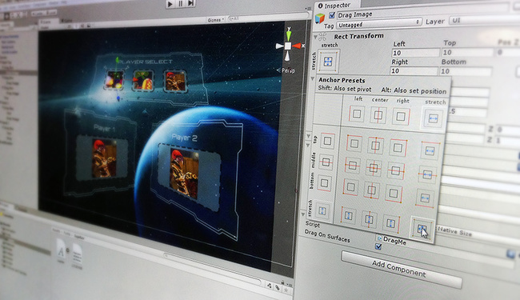

> 如果您觉得这个项目不错，请<a target='_blank' href="https://github.com/qq1012803704/unityui-documentation-in-chinese">点击Star一下</a>，您的支持是我最大的动力。

<!-- -->
> 个人技术水平受限，翻译过程中难免出现语句不通，翻译歧义等Bug，关于文档中翻译错误，逻辑错误以及疑难问题答疑，欢迎提交Issues或者直接Pull Requests，也可以关注["@喝红牛有力量"](http://weibo.com/acghongniu)微博，会统一收集处理。

#UI

The UI system allows you to create User Interfaces fast and intuitively. This is an introduction to the major features of Unity’s new UI system.

UI系统可以让你快速直观地创建用户界面。这是一篇Unity新的UI系统特征的介绍。

---
英文文档内容及图片版权归Unity Technologies公司所有，翻译文字内容请遵守MIT协议