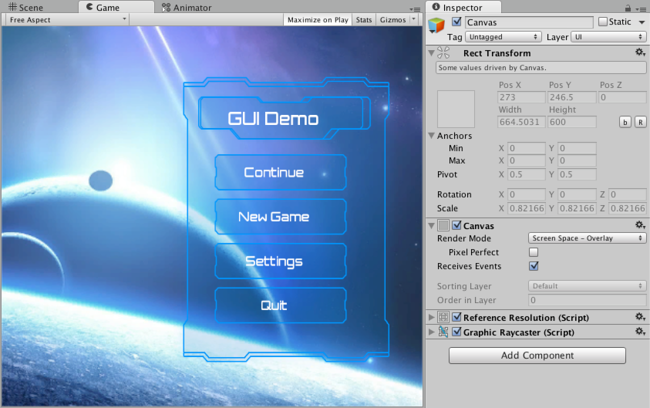

# Canvas画布

The Canvas is the area that all UI elements should be inside. The Canvas is a Game Object with a Canvas component on it, and all UI elements must be children of such a Canvas.

所有的UI元素都应该包含在画布里。canvas实际上是一个有canvas组件的Game Object（游戏对象），所有的UI组件必须是这个canvas的子对象。

Creating a new UI element, such as an Image using the menu GameObject > UI > Image, automatically creates a Canvas, if there isn’t already a Canvas in the scene. The UI element is created as a child to this Canvas.

创建一个新的UI元素，例如从菜单“ GameObject > UI > Image”创建一个image，如果当前场景中不存在一个canvas，则会自动的创建一个canvas。该UI元素会作为子对象创建在这个画布里。

The Canvas area is shown as a rectangle in the Scene View. This makes it easy to position UI elements without needing to have the Game View visible at all times.

在场景视图中canvas区域显示为一个矩形。这样就不需要一直看着Game视图，可以在Scene窗口里便捷的定位UI元素。

##Draw order of elements元素的绘制顺序

UI elements in the Canvas are drawn in the same order they appear in the Hierarchy. The first child is drawn first, the second child next, and so on. If two UI elements overlap, the later one will appear on top of the earlier one.

Canvas中的UI 元素以它们在Hierarchy模块中出现的相同顺序进行绘制。第一个子对象会第一个绘制，接下来是第二个子对象，以此类推。如果两个UI元素重叠，则晚一些绘制的会出现在早先绘制的上面

To change which element appear on top of other elements, simply reorder the elements in the Hierarchy by dragging them. The order can also be controlled from scripting by using these methods on the Transform component: SetAsFirstSibling, SetAsLastSibling, and SetSiblingIndex.

哪个元素需要显示在其他的元素之上，只要简单地去拖动元素即可重新排列他们在Hierarchy中的顺序。顺序也可以使用代码控制，通过调用Transform组件中的这些方法：SetAsFirstSibling，SetAsLastSibling，和 SetSiblingIndex。

##Render Modes渲染模式

The Canvas has a Render Mode setting which can be used to make it render in screen space or world space.

###Screen Space - Overlay

This render mode places UI elements on the screen rendered on top of the scene. If the screen is resized or changes resolution, the Canvas will automatically change size to match this.
